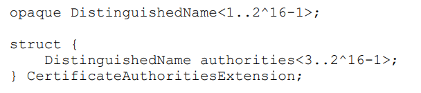
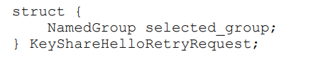
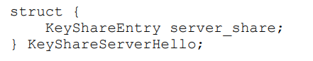
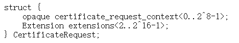
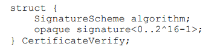
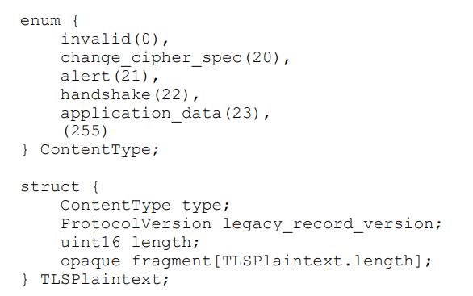
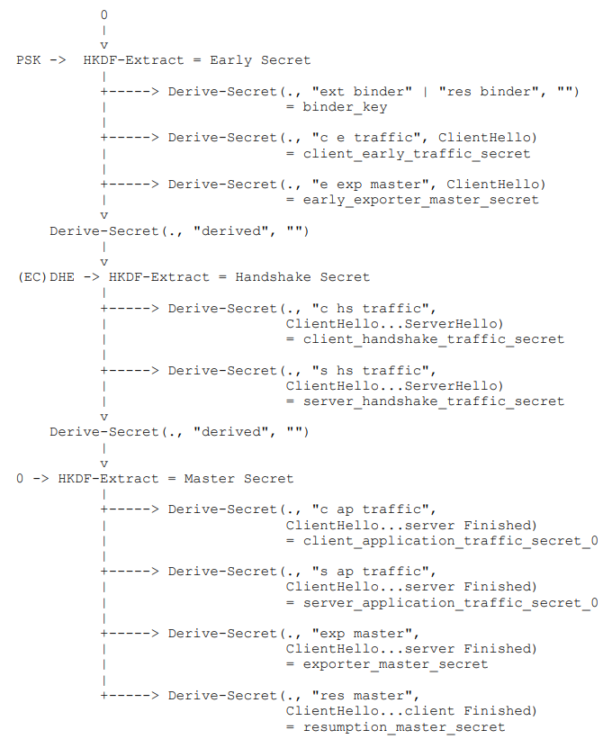
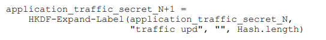
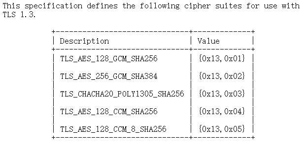

# 华为 | RFC 8446 & 8998 TLS 1.3总结

作者：王江桐、薛磊、陈明煜

> 本篇为 RFC 8446 TLS 1.3 内容整理与概述，非完整中文翻译，对于一些内容有顺序调整、添加说明、跳过和省略。RFC 8446 英文原文可见 https://datatracker.ietf.org/doc/html/rfc8446，中文网站自动翻译可见 https://rfc2cn.com/rfc8446.html。

## TLS 1.3概述：

- 服务端永远需要验证，客户端可选验证
- 组成部分：握手 (Handshake，协商链接的安全参数) 和 记录协议层（Record Protocol）
- 与之前版本不完全兼容
- **大端**传输 [p19]
- 禁止重协商
- 包括四种类型内容：
  - handshake
  - application_data
  - alert
  - change_cipher_spec，仅为兼容性目的使用

## 1.2 与 TLS 1.2 差异

#### 主要差异

- 修改了握手流程以及握手状态机，使得握手流程更加高效安全
  - ServerHello之后的所有握手消息现在都已加密。新引入的 EncryptedExtensions 消息允许以前在服务器Hello中以明文形式发送的各种扩展也可以享受保密保护
  - 合并 Hello 消息以及密钥交换消息
  - 修改恢复握手机制，使用 PSK 以及对应的 NewSessionTicket 消息，废弃 TLS 1.2 中的 SessionID 以及原来的 Ticket 模式
  - 废弃 TLS 1.2 版本的协商机制，使用 supported_versions 扩展表示支持 TLS 1.3，而非使用 Hello 消息中的版本参数
  - 删除例如 ChangeCipherSpec 等的冗余消息，只出于兼容性考虑保留部分处理机制
  - 废弃压缩模式，删除椭圆曲线算法的点格式协商
  - 添加重试机制
  - 添加了 0-RTT（零往返时间）模式，以牺牲某些安全属性为代价，在连接设置时为某些应用程序数据节省了往返时间
- 增加了新的扩展
- 增加了 post-handshake 流程
- 修改密码套成员以及主密钥计算方式
  - 将密钥交换算法的协商从密码包中分离出来
  - 对于对称算法，只支持使用 AEAD
  - 对于其他算法，去除了不安全的算法（如 MD5 与 SHA1），添加了新的算法（如 Ed25519 / 448）
  - 对关键的密钥派生函数进行了重新设计。主密钥现在将通过 HKDF 计算，而非 PRF

#### 国密与 TLS 1.3

TLS 1.3 与国密算法支持的定义于 [RFC 8998](https://datatracker.ietf.org/doc/html/rfc8998) 中。对于 TLS 1.3 的主要修改如下：

- 在算法套中新增国密算法套
  - AEAD：TLS_SM4_GCM_SM3，TLS_SM4_CCM_SM3
  - 签名算法：sm2sig_sm3
  - 密钥交换算法：curveSM2

RFC 8998 没有仔细规定如何使用密钥交换，可参考国家密码局规范 [GMT 0024-2014 《SSL VPN 技术规范》](http://www.gmbz.org.cn/main/viewfile/20180110021416665180.html)，使用 SM2 密钥交换时，双方必须互相发送证书，交换彼此公钥，再通过一般方式交换 DH 计算得出的 DH 公钥。

#### 细节表

| 大项     | 具体                 | TLS 1.3                                                      | TLS 1.2 及 之前版本                                          |      |
| -------- | -------------------- | ------------------------------------------------------------ | ------------------------------------------------------------ | ---- |
| 握手     | 握手流程             | 客户端在 ClientHello 的扩展中发送密钥交换相关信息            | 客户端在 Certificate 之后发送 ClientKeyExchange              | 改   |
|          |                      | 不使用 HelloRequest                                          | HelloRequest                                                 | 删   |
|          |                      | 使用 HelloRetryRequest                                       |                                                              | 增   |
|          | 握手设置             | 不使用压缩                                                   |                                                              | 删   |
|          | post-handshake       | TLS 1.3 有 post-handshake 机制，使用 application traffic key 加密，可发送 NewSessionTicket Msg，验证，更新密钥 | TLS 1.2 在 Finished 之后更改密钥需要重新握手，即重协商，但是这个有安全问题 | 改   |
|          | 版本表示             | 使用 supported_versions 扩展                                 | 使用 ClientHello.client_version / ServerHello.server_version | 改   |
|          | ClientHello          | 废弃使用 SessionID，使用一个随机数                           | 使用 SessionID                                               | 删   |
|          |                      | 不使用 PRF                                                   | cipher suites 要声明 PRF 算法                                | 删   |
|          | ServerHello          | ServerHello 之后消息全部加密                                 |                                                              | 改   |
|          | Finished Msg         | verify_data 长度取决于 HMAC 计算的结果                       | verify_data 长度固定为12字节                                 | 改   |
|          |                      | 使用 HMAC                                                    | 使用 PRF                                                     | 改   |
|          | 0-RTT 模式           | 可以发送 EarlyData                                           |                                                              | 增   |
| 恢复     |                      | 废弃 Session ID / Ticket 机制，改用 PSK (Pre-Shared Secret Key) | Session ID / Ticket                                          | 改   |
|          |                      | resumption-PSK 也需要协商扩展，每一次握手都需要协商扩展      |                                                              | 增   |
| 记录层   | nonce 计算           | 见 #5.2                                                      | 使用明确的 nonce [p83，#5.3]                                 | 改   |
|          | version              | 废弃之前版本使用的 TLSPlaintext.lagacy_record_version / TLSCiphertext.lagacy_record_version，出于兼容性目的保留，但是并不使用 |                                                              | 删   |
|          | TLSCiphertext.length | 长度限制为 2^14 + 255                                        | 长度限制为 2^14 + 2048                                       | 改   |
|          | TLSCiphertext        | encrypted_record -> AEAD 结果                                | fragment -> 加密 + MAC                                       | 改   |
|          | 密钥计算             | 使用 HKDF；密钥的长度和哈希算法的输出长度保持一致；密钥计算与 TLS 1.2 不同 | 使用 PRF [p64，#8.1；p25，#6.3]；master secret 长度为48字节 [p17] | 改   |
| 内容类型 | ChangeCipherSpec     | 不使用，出于兼容性目的会发送和略过指定值                     |                                                              | 删   |
| 算法     | 对称算法             | 仅保留 AEAD                                                  |                                                              | 删   |
|          | (EC)DHE              | 根据指定位数填充高位位数不足的0                              | 之前版本会去除高位的0                                        | 改   |
|          |                      | 废弃未验证的DH密码套                                         |                                                              | 删   |
|          | KDF                  | 使用 HKDF                                                    | 使用 KDF                                                     | 改   |
|          | ECC                  | 新算法                                                       |                                                              | 增   |
|          | ECC                  | 去除点格式协商，只能使用未压缩格式点                         |                                                              | 改   |
|          | RSA                  | 使用 RSASSA-PSS                                              |                                                              | 增   |
| 扩展     | supported_groups     | 重命名为 supported_groups，签名算法独立协商，不一起协商      | 原名 elliptic_curves，且只包括椭圆曲线算法，并且同时用于协商 ECDSA 的曲线 | 改   |
|          | supported_groups     | 删除不安全加密套，保留 AEAD                                  |                                                              | 删   |
|          | 算法套结构体         | 改名为 SignatureScheme。signature_algorithms 这一扩展有别的定义 | 枚举 SignatureAlgorithm                                      | 改   |
|          | SCT                  | SCT 信息作为扩展和 CertificateEntry 一起发送                 | SCT 作为扩展和 ServerHello 一起发送                          | 改   |
|          | OCSP Status and SCT  | OCSP 信息在 CertificateEntry 中附带，且 status_request 扩展必须保持 CertificateStatus 结构 | 扩展值为空来表示协商该扩展，并将 OSCP 信息放到 CertificateStatus Msg中 | 改   |
|          | Exporters            | 使用 HKDF 代替 PRF，且 context 为空或长度为0时，在 TLS 1.3 中，计算结果是**相同**的 | 使用 TLS pseudorandom function (PRF)。context 为空或长度为0时，计算结果**不同** | 改   |
|          | trusted_ca_keys      | 废弃                                                         |                                                              | 删   |
|          | status_request_v2    | 废弃                                                         |                                                              | 删   |
|          | cookie               | 可以使用 cookie                                              |                                                              | 增   |
| Alert    | Closure alert        | 对于 close_notify，发送表明发送方不会再发送新的消息了，随后发送的信息应当被忽略。必须在结束写链接之前发送，除非发送了 error alert。对于读链接没有影响。 | 此前版本中，收到 close_notify 之后，另外一方必须中断写，并且立马发送 close_notify。 | 改   |

#### 所有算法套

| 值        | RFC  | 出现位置                                | 算法名                       |
| --------- | ---- | --------------------------------------- | ---------------------------- |
| 0x13,0x01 | 8446 | ClientHello / ServerHello.cipher_suites | TLS_AES_128_GCM_SHA256       |
| 0x13,0x02 | 8446 | ClientHello / ServerHello.cipher_suites | TLS_AES_256_GCM_SHA384       |
| 0x13,0x03 | 8446 | ClientHello / ServerHello.cipher_suites | TLS_CHACHA20_POLY1305_SHA256 |
| 0x13,0x04 | 8446 | ClientHello / ServerHello.cipher_suites | TLS_AES_128_CCM_SHA256       |
| 0x13,0x05 | 8446 | ClientHello / ServerHello.cipher_suites | TLS_AES_128_CCM_8_SHA256     |
| 0x00,0xC6 | 8998 | ClientHello / ServerHello.cipher_suites | TLS_SM4_GCM_SM3              |
| 0x00,0xC7 | 8998 | ClientHello / ServerHello.cipher_suites | TLS_SM4_CCM_SM3              |
|           |      |                                         |                              |
| 0x0401    | 8446 | signature_algorithm(_cert) 扩展         | rsa_pkcs1_sha256             |
| 0x0501    | 8446 | signature_algorithm(_cert) 扩展         | rsa_pkcs1_sha384             |
| 0x0601    | 8446 | signature_algorithm(_cert) 扩展         | rsa_pkcs1_sha512             |
| 0x0403    | 8446 | signature_algorithm(_cert) 扩展         | ecdsa_secp256r1_sha256       |
| 0x0503    | 8446 | signature_algorithm(_cert) 扩展         | ecdsa_secp384r1_sha384       |
| 0x0603    | 8446 | signature_algorithm(_cert) 扩展         | ecdsa_secp521r1_sha512       |
| 0x0804    | 8446 | signature_algorithm(_cert) 扩展         | rsa_pss_rsae_sha256          |
| 0x0805    | 8446 | signature_algorithm(_cert) 扩展         | rsa_pss_rsae_sha384          |
| 0x0806    | 8446 | signature_algorithm(_cert) 扩展         | rsa_pss_rsae_sha512          |
| 0x0807    | 8446 | signature_algorithm(_cert) 扩展         | ed25519                      |
| 0x0808    | 8446 | signature_algorithm(_cert) 扩展         | ed448                        |
| 0x0809    | 8446 | signature_algorithm(_cert) 扩展         | rsa_pss_pss_sha256           |
| 0x080a    | 8446 | signature_algorithm(_cert) 扩展         | rsa_pss_pss_sha384           |
| 0x080b    | 8446 | signature_algorithm(_cert) 扩展         | rsa_pss_pss_sha512           |
| 0x0201    | 8446 | signature_algorithm(_cert) 扩展         | rsa_pkcs1_sha1               |
| 0x0203    | 8446 | signature_algorithm(_cert) 扩展         | ecdsa_sha1                   |
| 0x0708    | 8998 | signature_algorithm(_cert) 扩展         | sm2sig_sm3                   |
|           |      |                                         |                              |
| 0x0017    | 8446 | supported_groups 扩展                   | secp256r1                    |
| 0x0018    | 8446 | supported_groups 扩展                   | secp384r1                    |
| 0x0019    | 8446 | supported_groups 扩展                   | secp521r1                    |
| 0x001D    | 8446 | supported_groups 扩展                   | x25519                       |
| 0x001E    | 8446 | supported_groups 扩展                   | x448                         |
| 0x0100    | 8446 | supported_groups 扩展                   | ffdhe2048                    |
| 0x0101    | 8446 | supported_groups 扩展                   | ffdhe3072                    |
| 0x0102    | 8446 | supported_groups 扩展                   | ffdhe4096                    |
| 0x0103    | 8446 | supported_groups 扩展                   | ffdhe6144                    |
| 0x0104    | 8446 | supported_groups 扩展                   | ffdhe8192                    |
| 0x0029    | 8998 | supported_groups 扩展                   | curveSM2                     |

### 2. 握手流程

状态机可见附录A。

#### 无 Retry [p11 - p13]

1. 客户端发送 ClientHello

   - ClientHello 中：

     - CipherSuites：提供 AEAD / HKDF 哈希算法对
     - random：32位随机数

   - TLS 1.3 以 supported_versions 扩展表示 1.3 版本

   - 使用 (EC)DHE 的选项 → supported_groups 扩展 + key_share 扩展

     - supported_groups 扩展表示可用的算法
     - key_share 扩展由多个 KeyShareEntry 组成一个 vector，每一个 KeyShareEntry 表示了其使用的算法，以及算法计算得出的交换公钥

   - 使用 PSK 的选项 → pre_shared_key 扩展 + psk_key_exchange_modes 扩展

     - pre_shared_key 扩展表示 psk 的 identity，即具体选择哪个 psk。一次握手可能有多个 ticket
       - psk 由两种方式获得：Ticket，或者在 TLS 1.3 协议之外协商
       - psk、上一次握手中的 resumption_master_secret、ticket 之间的关系为：
         - psk = HKDF_Expand_Label( resumption_master_secret, "resumption", ticket_nounce, Hash.length )
       - NewSessionTicket.ticket = PskIdentity.identity
     - psk_key_exchange_modes 扩展表示，仅使用 psk，或使用 psk + (EC)DHE。使用 psk + (EC)DHE 时，必须包括 key_share 扩展
     - **如果使用 psk，则不验证书**

   - signature_algorithms：使用的签名算法，**需要校验服务器证书时必选**

     - 如果证书签名算法不同，可以考虑发送 signature_algorithms_cert 表示证书签名算法

     

2. 服务器发送 ServerHello

   - ServerHello：
     - cipher_suite：选择的密码套
   - 选择使用 (EC)DHE：发送 key_share 扩展
   - 选择使用 psk：发送 pre_shared_key 扩展，包含一个 identity 索引号
   - <u>*使用 psk 的话，需要根据客户端的 psk mode 使用*</u>
   - **必选**：发送 EncryptedExtensions 扩展

   

3. 服务端：

   3.1 要求验证客户端身份：发送 CertificateRequest 扩展

   3.2 不选择使用 psk：发送服务端证书 + CertificateVerify

   3.3 发送 Finished

​     

4. 客户端回应：

   4.1 如果被要求验证身份：发送客户端证书 + CertificateVerify

   4.2 发送 Finished

#### 2.1 Retry [p14]

1. 客户端发送 ClientHello，同无 Retry 流程

   - KeyShareClientHello，即 ClientHello 的 key_share 扩展，客户端可以将算法值的列表长度设为0，强制要求服务端发送 Retry，来看服务端选择什么算法，再进行计算

   

2. 服务器发送 HelloRetryRequest，与 ServerHello 结构一致

   - 场景：

     - 服务端挑的 (EC)DHE group 在客户端中没有匹配的 key_share 扩展

   - HelloRetryRequest (ServerHello)：

     - cipher_suite：选择的密码套

     - 将 random 的值设为：

       > CF 21 AD 74 E5 9A 61 11 BE 1D 8C 02 1E 65 B8 91 
       >
       > C2 A2 11 16 7A BB 8C 5E 07 9E 09 E2 C8 A8 33 9C

     - **必须**包括 supported_versions 扩展

     - 包括 key_share 扩展，选择一个服务器想使用的算法。这一算法可能不在客户端第一次的 ClientHello 算法套中

     - 可选：包含 cookie 扩展

       - cookie：服务端并不会存储上一次 ClientHello 的值，在 cookie 中包含使用它计算的哈希值，便于服务端下一次校验

   - 选择使用 (EC)DHE：发送 key_share 扩展

   - 选择使用 psk：发送 pre_shared_key 扩展，包含一个 identity 索引号

     

3. 客户端再次发送 ClientHello：

   - 再次发送 ClientHello，在其中复读同样的消息，但是作如下修改：

     - 如果 HelloRetryRequest 包含指定 key_share 扩展，回复时只包括该指定扩展

     - **可选**移除与服务端不兼容的 PSK，也可以不移除

     - 如果 HelloRetryRequest 包含 cookie 扩展，回复时也包含 cookie 扩展

       - cookie：复读发送过来的 cookie

     - 移除 Early Data

     - 如果含有 pre_shared_key 扩展，重新计算 obfuscated_ticket_age 和 binder values

     - **可选**添加、移除、修改 padding 扩展的长度，也可以不修改

       

4. 服务端发送 ServerHello，之后同无 Retry 流程

#### 2.2 PSK && Resumption [p15 - 17]

TLS 1.3 恢复握手也需要完整的协商流程。使用 psk，则服务端不需要发送证书验证身份。

#### 2.3 0-RTT 数据 (Early Data)

PSK情况下可以提早发数据，使用 PSK 计算出来的密钥加密 Early Data，但是安全属性会比其他 TLS 数据更弱一些：没有向前秘密性，不能保证不会被重放攻击（不像 1-RTT，有随机数）。

例如：

流程同之前。0-RTT 数据使用 pre_shared_key 扩展中第一个 psk 计算得出的密钥加密。数据同时可以被包含在 pre_shared_key 中，如果包含，则放在 identities 列表的首位，identities[0] 的值即为 0-RTT 数据的值。

如果服务端要求 Retry，则客户端不可以再发送 0-RTT 数据。

### 3. 基础数据结构

### 4. 握手协议：协商安全参数

- Enum HandShakeType：p25

- Struct Handshake：p25

#### 4.1 Key Exchange Msg

##### 4.1.1 密码套协商

通过在 ClientHello 中提供以下选项来协商：

- CipherSuites: AEAD / HKDF pairs

- supported_groups 扩展：(EC)DHE 支持；key_share 扩展：包括 (EC)DHE shares

- signature_algorithms 扩展：支持哪些签名

- pre_shared_key 扩展：支持的 Symmetric Key Identities；psk_key_exchange_mode 扩展：PSK可用的密钥交换模式

  

服务端响应：

- 当服务端不选择 PSK：
  - 服务端挑个密码套，(EC)DHE 组 && 交换秘密，签名 / 证书算法套
- 当服务端选择 PSK：
  - 服务端挑个密码套，(EC)DHE 组 && 交换秘密，签名 / 证书算法套，**选择密钥交换模式**

- 如果服务端挑的 (EC)DHE group 在客户端中没有匹配的 key_share 扩展：
  - **HelloRetryRequest Msg**
- 如果服务端最后无法和客户端协商合适的参数，服务端必须终止握手，并返回 **handshake_faliure** 或者 **insufficient_security alert**
- 如果一切都顺利，在 ServerHello 中：
  - 如果选择 PSK
    - 发送 pre_shared_key 扩展
  - 如果选择 (EC)DHE
    - 发送 key_share 扩展。如果此时 PSK 没有选择，那么一定会选择 (EC)DHE
  - 如果通过证书验证，服务器会发送 Certificate 以及 CertificateVerify。要不选择 PSK ，要不选择证书验证，不可以同时选择，除非之后的 RFC 对此有说明。

##### 4.1.2 ClientHello

参数：

- **lagacy_version** 字段值一定是 0x0303，这个是 TLS 1.2 的版本号
  - supported_versions 扩展：将 0x0304 作为最高版本
- random：随机数
- legacy_session_id：必须设置且非空非单个0，TLS 1.3 之前版本使用之前的 session_id，TLS 1.3 版本生成新的32字节值，不必是随机值，但是要求不可预测
- cipher_suits：对称加密算法套，将作为记录保护算法（包括一个密钥长度），HKDF 使用的哈希算法，根据客户端的优先级排序。如果使用 PSK，那么必须包含至少一个密码套，该密码套提供该 PSK 可使用的哈希。具体值可见 B.4。
- legacy_compression_methods：兼容 TLS 1.2，但是对于 TLS 1.3，这里必须被设置为单字节值`[0]`，表示 Null
- extensions：额外扩展，见 #4.2，有 些扩展是必须的
  - **TLS 1.3 一定会包括拓展**，可以通过 compression_methods 之后是否还有字节判断
  - 如果服务端不支持客户端的一些扩展，客户端**可能**会终止握手

ClientHello 是客户端链接时必须发送的第一条消息。**如果 Early Data 可用，在等待下一条消息时，客户端会传输 early Application Data**。

如果收到 HelloRetryRequest，客户端必须再次发送 ClientHello，并在其中复读同样的消息，除非：

- HelloRetryRequest 包含指定 key_share 扩展，回复时只包括该指定扩展
- HelloRetryRequest 包含 cookie 扩展，回复时也包含 cookie 扩展
- 移除 Early Data
- 如果含有 pre_shared_key 扩展，重新计算 obfuscated_ticket_age 和 binder values。可选：移除与服务端不兼容的 PSK
- 可选：添加、移除、修改 padding 扩展的长度
- *其他等扩展或后续 RFC 规定*

服务端对于 ClientHello 的响应：

- TLS 1.3 禁止重协商，如果在不正确的时机收到 ClientHello，服务端终止链接并返回 **unexpected_message alert**
- ClientHello 中的密码套如果服务端不用，无视就行，其他照旧
- 如果协商版本为 TLS 1.3，且 ClientHello.legacy_compression_methods 值不为单字节`[0]`，那么服务端终止链接，返回 **illegal_parameter alert**；如果协商版本含有老版本 e.g. 客户端是老版本，那么这一字段可能不为单字节`[0]`，按照老版本的 RFC 走
- extensions：无视不兼容的扩展
  - 首先检查 compression_field 之后是否含有扩展，只有 supported_veresions 扩展存在时，对方是 TLS 1.3
  - 如果是 TLS 1.3，那么 compression_method 之后包含合理的扩展，且在扩展之后无额外数据；如果不是且旧版本不包括扩展，那么 compression_field 之后应该没有额外的字节。如果不是以上两种情况，返回 **decode_error alert**

##### 4.1.3 ServerHello

参数说明：

- lagacy_version：TLS 1.3 由扩展 supported_versions 字段标识版本，该字段值为 0x0303，是 TLS 1.2 的版本号
- random：随机数生成器，当协商 TLS 1.2 / 1.1 时，最后8字节会被覆写，应与客户端的 random 生成独立
  - 协商 TLS 1.2，最后8字节为：`44 4F 57 4E 47 52 44 01`
  - 协商 TLS 1.1 或更低版本，最后8字节为：`44 4F 57 4E 47 52 44 00`
  - **防止协议降级**
- legacy_session_id_echo：复读
- cipher_suite：单一的、服务端选择使用的密码套，密码套来自于客户端提供的列表
- lagacy_compression_method：值为0
- extensions：只包括用于建立密码用上下文以及协商版本号的扩展。所有 TLS 1.3 的 ServerHello **必须**包括 supported_versions 扩展。可包括 pre_shared_key 与 / 或 key_share。其余扩展通过 EncryptedExtensions 信息发送。

ServerHello 会复读 ClientHello 中的参数，表明选择的具体参数。

客户端响应：

- 复读的 lagacy_session_id_echo 与发送的不同时，终止握手并返回 **illegal_parameter alert**
- 服务端回复、决定使用的密码套不是客户端列表内的密码套，终止握手并返回 **illegal_parameter alert**
  - 如果此前收到 HelloRetryRequest，检查两次回复中的密码套是否是同一个，如果不是，终止握手并返回 **illegal_parameter alert**
- 验证 random，如果对方宣称版本是 TLS 1.2，验证最后8字节是否为`44 4F 57 4E 47 52 44 01`，如果宣称是更低版本（1.1以及更低），验证最后8字节是否为`44 4F 57 4E 47 52 44 00`。如果匹配，则宣称的版本不对（这个是 TLS 1.3 的操作），终止握手并返回 **illegal_parameter alert**
  - *此处与 RFC 5246 不同，实际上很多 TLS 1.2 服务端和客户端不会这样检查*

##### 4.1.4 HelloRetryRequest

与 ServerHello 结构基本相同，但是将 random 的值设为：

> CF 21 AD 74 E5 9A 61 11 BE 1D 8C 02 1E 65 B8 91 
>
> C2 A2 11 16 7A BB 8C 5E 07 9E 09 E2 C8 A8 33 9C

(这个是 "HelloRetryRequest" 的 Sha256 值)

必须包括 supported_versions 扩展，必须包含最少的、可以让客户端生成正确 ClientHello 的扩展。**除了 cookie 扩展，不能包括任何客户端之前没有提到的扩展**。

客户端响应：

- 检查 Random 值是否是如下值，以此标识 HelloRetryRequest ：

  > CF 21 AD 74 E5 9A 61 11 BE 1D 8C 02 1E 65 B8 91 
  >
  > C2 A2 11 16 7A BB 8C 5E 07 9E 09 E2 C8 A8 33 9C

- 验证 legacy_version，legacy_session_id_echo，cipher_suite，legacy_compression_method

  - 从验证 supported_versions 扩展开始
    - 如果值改变，终止握手并返回 **illegal_parameter alert**
  - 如果 HelloRetryRequest之后，ClientHello 不做任何改变，那么 终止握手并返回 **illegal_parameter alert**

- 如果第二次收到 HelloRetryRequest，终止握手并返回 **unexpected_message alert**

- **必须**处理所有 HelloRetryRequest 中包含的扩展，然后发送第二个 ClientHello

旧版本的 TLS 客户端进行重协商时，如果在重协商过程中收到 TLS 1.3 的 ServerHello，应当终止握手并返回 **protocol_version alert**

##### change_cipher_spec

- 在第一次 ClientHello 之后，以及 Finished 之前，终端随时可能收到未加密数据 change_cipher_spec，由单一字节 0x01 组成
  - 在解密信息之前需要校验是否是该值
  - 不需要处理
  - 如果收到了其他的值，或是收到了加密的该数据，则终止握手，返回 **unexpected_message**
  - 如果在不恰当的时间收到该值，终端必须将其认作是 unexpected record type，并返回 **unexpected_message alert**

#### 4.2 扩展

有些扩展是 request / response 类型，有些不需要回复：

- 客户端在 ClientHello 中发送扩展请求
  - 服务端在 ServerHello、EncryptedExtensions、HelloRetryRequest、Certificate 中回复这些扩展请求
- 服务端在 CertificateRequest 中发送扩展请求
  - 客户端可能会在 Certificate Msg 中回复这些扩展请求
- 服务端可能在 NewSessionTicket 中发送未请求的扩展
  - 客户端不会直接回复这些扩展，不过会有其他方式处理

- **除了 HelloRetryRequest 中的 cookie 扩展，不可以在未经请求的情况下，发送回复**。如果收到这类消息，任意一端应当 终止握手并返回 **unsupported_extension alert**
- 扩展可能以任意顺序出现，但是 pre_shared_key 一定是 ClientHello 中**最后一个**扩展。在 ServerHello 中 pre_shared_key 没有确定的位置
- 同一个扩展块中，同一扩展只能出现唯一的一次
- **与 TLS 1.2 不同**，每一次握手时都需要协商扩展，即使是 resumption-PSK 模式
  - 0-RTT 参数在上一次握手中协商，不匹配的情况会拒绝 0-RTT

扩展出现的对应消息：

| 简写 | 含义                |
| ---- | ------------------- |
| CH   | ClientHello         |
| SH   | ServerHello         |
| EE   | EncryptedExtensions |
| CT   | Certificate         |
| CR   | CertificateRequest  |
| NST  | NewSessionTicket    |
| HRR  | HelloRetryRequest   |

如果扩展出现在不合适的地方，终止握手并返回 **illegal_parameter alert**。

##### 4.2.1 supported_versions

- 客户端表明支持版本
  - 包含支持版本列表，以优先级降序排列
  - 协商 TLS 1.3 时，客户端必须首先检查 supported_versions 扩展。如果存在，则必须忽略 ServerHello.legacy_version，使用扩展决定版本。如果扩展决定的版本客户端不支持，或非 TLS 1.3（即值不为 0x0304），则终止握手，并返回 illegal_parameter alert
- 服务端表明使用版本
  - 如果没有这个扩展，兼容 TLS 1.2 以及更低版本的服务器必须协商之前的版本，不可以协商 TLS 1.3
    - 当 ClientHello.lagacy_version >= 0x0304时，服务端或许会终止握手
  - 当有这个扩展时，服务端必须使用该扩展来决定客户端偏好的版本，而非 ClientHello.lagacy_version 字段。服务端忽略其中所有未知的版本。因此，最后协商结束时，也许使用的不是 TLS 1.3 版本，而是旧版本进行协议沟通
  - 协商非 TLS 1.3 版本时，服务端必须使用 ServerHello.version，不能发送 supported_versions 扩展。协商 TLS 1.3 版本时，服务器必须发送 supported_versions 以及 TLS 1.3 对应版本号（0x0304），且必须将 ServerHello.legacy_version 设置为 0x0303
- **TLS 1.3 版本端必须支持 TLS 1.2**

##### 4.2.2 Cookie

目的：

- 强制要求客户端证明，目前的客户端地址是可用的（提供 DoS 保护）

- 服务端状态转移给客户端，由客户端存储状态，当服务端发送 HelloRetryRequest 时，服务端不需要存储状态，而只存储 ClientHello 的哈希值 → Retry 之后，服务端第二次收到 ClientHello 时，需要交验两次 ClientHello 是否相同。

可以选择作为 HelloRetryRequest 的扩展发送。如果 HelloRetryRequest 包括该扩展，新的 ClientHello 应当将 HelloRetryRequest 中的扩展内容复制进 cookie 扩展。客户端不可以在之后的连接中，在第一个 ClientHello 中使用该 cookie，即服务端不应当收到两次相同的 ClientHello。

※ 如果服务端不存储状态，在两个ClientHello 之间，可能会受到未保护的记录 change_cipher_spec，由于服务端不存储状态，这个记录形似第一条收到的记录。无状态服务端需要忽视这些记录。

##### 4.2.3 signature_algorithms

涉及到的两个扩展：

- signature_algorithms_cert 扩展应用于证书的签名：

  - 证书公钥必须是同一个算法

  - 当这一扩展缺失时，使用 signature_algorithms 扩展中的算法

- signature_algorithms 扩展应用于 CertificateVerify Msg：

  - 需要服务端验证身份时，客户端必须发送此扩展

  - 如果客户端未发送此扩展，但是同时要求服务端发送证书，服务端终止握手，并返回 **missing_extension alert**

  - 每一个 SignatureScheme 值列举单一的算法，且客户端支持这些算法，以优先级降序排序。**签名算法获取 raw data of msg as input**，而非它们的哈希值

※ 自签名的证书或作为 trust anchors 的证书的签名算法不会被验证。这些证书的签名算法可能与扩展中提到的算法不同。

关于 TLS 1.2 兼容：

- TLS 1.2 ClientHello 可能会略过该扩展
- TLS 1.2 中，该扩展可能包含 hash / signature pairs。密码对编码为两个字节，所以 SignatureScheme 值与 TLS 1.2 的编码对齐
  - 一些遗留密码对已被删除，例如不安全的算法 MD5，SHA-224，DSA。**不可以**使用不安全算法。
- ECDSA 签名算法与 TLS 1.2 ECDSA 的 hash / signature pairs 对齐。旧语法可能没有限制签名曲线，如果协商使用 TLS 1.2，需要准备使用在 supported_groups 中提到的任意曲线
- 可能使用 RSASSA-PSS，TLS 1.2 没有规定该算法

##### 4.2.4 certificate_authorities

该扩展用于表明端支持的 Certificate Authorities (CAs)，从而选择对应的证书。参数 authorities 标识可辨别的权威名，表明可接受的 CAs，以 DER 编码。

可以选择在以下信息发送：

- 客户端：ClientHello
- 服务端： CertificateRequest

**废弃 trusted_ca_keys 扩展**。

##### 4.2.5 oid_filters

服务端提供 oid / value pairs，希望客户端的证书能匹配这些键值对。

**只能在服务端的 CertificateRequest 中发送**：

- 证书扩展 OIDs + 允许的 values，以 DER 编码
- OID 只能出现一次

终端处理：

- 客户端回复：
  - 回复中包括所有识别出来的 OID + 服务端声明的值
  - 忽略无法识别的 OID
- 服务端接收回复：
  - 如果客户端忽略了一些 OID = 客户端不完全满足要求，服务端可以考虑继续链接，或终止握手，返回 **unsupported_certificate alert**
- TLS 具体实现依赖于 PKI 库识别和挑选证书
  - RFC 8446规定：
    - Key Usage 扩展匹配，要求所有服务端请求中声明的 Key Usage bits 都在证书中有匹配
    - Extended Key Usage 扩展匹配，要求所有请求中声明的 Key Purpose OID 也在 Extended Key Usage Certificate 扩展中声明。在请求中，不应当使用特殊的 anyExtendedKeyUsage OID。

##### 4.2.6 post_handshake_auth

当客户端发送此扩展，则意味着客户端倾向于实行 post-handshake authentication。如果客户端没有提供这个扩展，服务端不可以发送 post-handshake CertificateRequest 给客户端。服务端**不可以**发送这个扩展。

※ 对于该扩展，extension_data 字段长度为0。

##### 4.2.7 supported_groups

客户端使用该扩展表明支持的、用于密钥交换的算法，以优先级降序排列。在之前版本，该扩展名为 elliptic_curves，且只包括椭圆曲线算法，并且同时用于协商 ECDSA 的曲线。TLS 1.3 中，扩展名修改为 supported_groups，且签名算法独立协商，不一起协商，即 supported_groups 只协商密钥交换算法。

客户端的算法优先级互相冲突的情况在 RFC 7919 中有详细说明。一般情况来说，客户端要避免这种情况，如果发生，服务端优先考虑 supported_group 扩展的优先级排序，当然也可以用其他合适的方式解决冲突

> e.g. ClientHello cipher suites：<TLS_DHE_RSA_WITH_AES_128_CBC_SHA, TLS_ECDHE_RSA_WITH_AES_128_CBC_SHA>；supported_group extension：<secp256r1, ffdhe3072>
>
> - 这种情况下是冲突的，因为 cipher suites 的优先级和 supported_group 扩展的优先级是相反的
> - 如果用默认方式解决，服务端会使用 TLS_ECDHE_RSA_WITH_AES_128_CBC_SHA，即以supported_group 扩展的优先级排序 

TLS 1.3 中，服务端可以向客户端发送 supported_groups 扩展。在握手完成之前，客户端不可以利用这个信息，更改 key_share 扩展中的优先级，但是可以使用已成功的握手经验更新新握手中 key_share 扩展中的优先级。如果服务端的偏好算法不在客户端的 key_share 扩展中，服务端必须发送 supported_groups 扩展，且该扩展应包括服务端支持的**所有**算法，不论客户端是否支持这些算法。

##### 4.2.8 key_share

参数说明：

- group：The named group for the key being exchanged

- key_exchange：额外信息，由具体的算法决定

  

客户端处理：

- 客户端可以发送空 client_shares vector，向服务端请求 group 选择

  

- 如果客户端希望通过 HelloRetryRequest 来收到服务端的回应，可以将该 vector 设空

  - 如果 Retry：
    - 校验：
      - 验证发送回来的 selected_group 属于 supported_group
      - selected_group 不是 KeyShareEntry 中已经提供参数的算法
      - 如果使用 (EC)DHE，客户端需要校验 ServerHello 发送回来的算法与 HelloRetryRequest 中的算法是同一个
    - 如果任意一条失效，返回 **illegal_parameter**
    - 如果成功，客户端必须将原先的 key_share 值更改为仅包含 selected_group 算法的 KeyShareEntry 参数套

- 每一个 KeyShareEntry 的值必须与 supported_groups 中的扩展匹配，且必须以同一个顺序出现，但是可以忽略或略过一些算法，即 KeyShareEntry 的算法套是 supported_groups 算法套的子集

  - 客户端可以发送很多 KeyShareEntry 值，最多与 supported_groups 的支持算法数相同。同一个算法不能有多个参数套值

服务端处理：

- Retry 的情况：

  

  - NamedGroup：双方都支持的算法，发送 HelloRetryRequest 请求客户端发送相应参数
  - 如果客户端的 KeyShareEntry 不在 supported_groups 中，返回 **illegal_parameter alert**

- ServerHello 的情况：

  

  - server_share：对于客户端提供参数的某个算法，服务端返回对应算法的服务端计算值（交换秘密）
    - 如果使用 (EC)DHE，服务端仅发送唯一的 KeyShareEntry 值
    - 不可以发送不在客户端 supported_groups 里的算法对应的参数
    - 不可以在使用 "psk_ke" PskKeyExchangeMode 时发送 KeyShareEntry

###### 4.2.8.1 Diffie-Hellman 参数

☆ 交换秘密与素数 p 比特长度一致，以大端表示

###### 4.2.8.2 ECDHE 参数

P256 / 384 / 521 必须验证公钥合法：

- 在线上
- 非无穷远点
- 公钥点在域内

##### 4.2.9 psk_key_exchange_modes

如果客户端想要使用 PSK：

- 如果客户端使用 pre_shared_key 扩展，客户端**必须**发送 psk_key_exchange_modes 扩展
- 客户端只支持这些模式的 PSK 使用，**禁止**使用 ClientHello 中的 PSK 以及服务端在 NewSessionTicket 中提供的 PSK

服务端响应：

- 如果客户端发送了 pre_shared_key 扩展，但是没有发送 psk_key_exchange_modes 扩展，服务端需要终止握手
- 服务端必须选择客户端提供的密钥交换模式
- 服务端禁止发送与客户端提供的模式不兼容的 NewSessionTicket，不过此条只会导致客户端恢复握手失败
- 服务端禁止发送 psk_key_exchange_mode

##### 4.2.10 Early Data

客户端处理：

- 如果客户端想要在第一次交互信息时发送 Early Data，客户端**必须**提供 pre_shared_key 和 early_data 扩展，同时， pre_shared_key 扩展要求客户端提供 psk_key_exchange_modes 扩展
- 参数和加密 Early Data 的 PSK 相关
- 收到服务端的 Finished Msg 时，如果服务端接收了 Early Data，客户端应当发送 EndOfEarlyData Msg，该信息由 PSK 加密
- 如果服务端拒绝 early_data 扩展，客户端可选在握手之后重新传输 Early Data 中的应用数据
  - ☆ 自动重发可能会造成对于链接状态的不正确推测 -> e.g. 链接使用另一个 ALPN 协议
  - TLS 协议不能自动重发 early data，除非协商选择了同一个ALPN 协议

服务端响应：

- Early Data 处理前提：

  - 如果 PSK 通过 NewSessionTicket 提供，服务端必须校验 ticket 的生命周期（生命周期 = (PskIdentity.obfuscated_ticket_age - ticket_age_add) % 2^32）。如果 ticket 生命周期已结束，服务端应当继续握手，但是拒绝 0-RTT，不应当采取其他措施认为当前 ClientHello 是第一次发送
  - 服务端必须接受使用 PSK 密码套且使用第一个由客户端在 pre_shared_key 扩展中提供的密钥。此外，服务端必须验证该 PSK 中的 TLS 版本号、密码套、（如果存在的话）ALPN 协议
  - 如果任何一个检查失败，服务器不可以回复该扩展，必须使用以下的第一种或第二种方式，将数据降级为 1-RTT，或直接丢弃。如果客户端请求 0-RTT，但是服务端拒绝了，服务端通常不会持有 0-RTT 记录保护密钥，相应的，只能通过 1-RTT 握手密钥或在重试的情况下，查找 ClientHello 中是否有明确明文，来尝试解码并找到第一个非 0-RTT Msg

- 收到 Early Data 的服务端只可能有以下三种响应中的一种：

  - 忽视该扩展，返回通常的 1-RTT 响应。服务器会试图解保护（Deprotect）收到的记录，并且跳过无法解保护的数据（最多解到 max_early_data_size）。如果成功解保护，那么这些数据将被认为是下一次（第二次）发送过来的数据，服务器会使用 1-RTT 握手处理

  - 通过 HelloRetryRequest 要求客户端再次发送 ClientHello，以此种方式跳过 early_data 扩展

  - 在 EncryptedExtensions 中返回服务端的 early_data 扩展，表示服务端将接收并处理 early_data。服务器不可以只处理 early_data 的子集，必须全部处理。不过，当服务器发送信息表示它会接收并处理 early_data 时，early_data 的传输可能还没有完成

    - 处理 early_data 时，服务端的错误处理方式必须与处理其他记录的方式一致
    - 如果在发送接收 early_data 扩展之后，服务器无法解码 0-RTT 记录，服务器必须终止链接并返回 **bad_record_mac alert**

    

##### 4.2.11 pre_shared_key

该扩展用于协商使用何种 PSK。每一个 PSK 都会声明一个哈希算法，对于通过 ticket 协商的 PSK ，哈希算法使用 KDF 算法中的哈希。对于外部协商的 PSK，哈希算法默认为 Sha256，必须通过设置使用其他哈希算法。

☆ 恢复 Session 是 PSK 的主要用途

※ 可以考虑先协商密钥对，然后去除所有不支持的算法，提升效率

参数说明：

- identity：密钥的标签
- obfuscated_ticket_age：如果 PSK 通过 NewSessionTicket 生成，那么由 NewSessionTicket 生成时决定该值；如果 PSK 由外部生成，那么这个值必须设置为 0，服务器必须忽视这个值
- identities：客户端希望协商的一系列参数。如果与 early_data 一同发送，那么第一个 identity 是 0-RTT 数据
- binders：HMAC 值，与 identities 一一对应
- selected_identity：服务端选择的 identity，索引从 0 开始，列表是客户端发送的 OfferedPsks 中的 identities

客户端处理：

- 客户端必须验证服务端发送的 selected_identity 在客户端之前提供的列表里，服务端选择了该 PSK 对应的哈希，且如果客户端 ClientHello 中要求 psk_key_exchange_mode 扩展，服务端的回复应包括 key_share 扩展。如果以上验证不对，客户端终止握手并返回 **illegal_parameter alert**
- 如果服务器提供 early_data 扩展，客户端必须验证服务器 selected_identity 是0。如果服务器返回其他值，客户端必须终止握手并返回 **illegal_parameter alert**

服务端响应：

- pre_shared_key 扩展必须是 ClientHello 中发送的最后一个扩展，如果它不是，服务端终止握手，并返回 **illegal_parameter alert**
- 接受 PSK 之前，服务端需要验证对应的 binder 值，如果该值不存在或验证失败，服务器应当终止握手。服务端不应当同时验证多个 binder，只应当验证准备选择的 PSK 对应的 binder
- 接受 PSK 之后，服务器发送 pre_shared_key 扩展表明选择的 identity

###### 4.2.11.1 Ticket Age

客户端处理：

- PSK 的生命周期从客户端收到 NewSessionTicket 开始计算
  - obfuscated_ticket_age = (age in milliseconds + ticket_age_add) % 2^32
- 客户端不可以使用比 ticket_lifetime（in seconds，最多一星期） 值生命周期还要长的 Ticket

###### 4.2.11.2 PSK Binder

将 PSK 与当前握手联系起来，计算 ClientHello 除了 binders 以外的所有内容 + PreSharedKeyExtension.identities 的 HMAC 值。与 Finished Msg 计算方式类似，不过使用 PSK 作为基础密钥。

如果握手包括 HelloRetryRequest，那么计算时会包括第一次 ClientHello、HelloRetryRequest 以及第二次 ClientHello。

###### 4.2.11.3 Processing Order

在收到服务端发送的 Finished Msg 之前，客户端可以发送 0-RTT Data，并且在收到 Finished 之后，可发送 EndOfEarlyData Msg。当服务端收到 early_data，服务端必须先处理客户端的 ClientHello，并且随后直接发送 ServerHello 或 HelloRetryRequest / etc.，而非等待客户端的 EndOfEarlyData Msg，以避免死锁。

#### 4.3 服务端参数（Server Parameters）

以下两个扩展的密钥来自于 server_handshake_traffic_secret。

##### 4.3.1 Encrypted_Extensions

包含可保护的信息，这些信息与建立密码相关上下文无关，与独立证书也无关。

客户端必须验证确实收到 EncryptedExtensions ，同时不存在禁止的，即不在允许列表里的扩展。如果发现，则终止握手，返回 **illegal_parameter alert**。

在所有握手中，服务端在发送 ServerHello 后，必须发送 EncryptedExtensions Msg。该信息由 server_handshake_traffic_secret 加密，且是第一个使用该密钥加密的信息。

##### 4.3.2 Certificiate Request

服务器可以选择向客户端发送此扩展并请求证书。

参数说明：

- certificate_request_context：应当避免重放攻击，即应当对于当前上下文来说是唯一的，且在非 post-handshake authentication exchanges 场景下，长度应当为0。当请求 post-handshake authentication 时，服务端应当使得该上下文对于客户端不可预测（e.g. 使用随机数）
- extensions：服务端请求的证书参数，客户端必须声明 signature_algorithm 扩展

客户端响应：

- 在回复的 Certificate Msg 中复读服务端发送的 CertificateRequest。忽略未识别的扩展。

服务端发送：

- 如果使用 PSK 验证，在 main handshake 中不可以发送该扩展，可以在 post-handshake authentication 中发送。post-handshake 通过客户端发送 post_handshake_auth 扩展来协商。
- 如果请求证书，则 CertificateRequest 必须在 EncryptedExtension 之后立刻发送。

#### 4.4 验证信息（Authentication Messages）

以下信息使用 [sender]_handshake_traffic_secret 加密，计算输入如下：

- 证书 + 签名密钥
- 握手上下文，由组成 transcript hash 的信息组成
- 计算 MAC 密钥的基础密钥

Authentication Msg 包括：

- Certificate：用于验证的证书，以及证书链里的证书。在 PSK 握手流程中不适用。
- CertificateVerify：Sign( transcript_hash(Handshake Context, Certificate) )
- Finished：MAC( transcript_hash(Handshake Context, Certificate, CertificateVerify), key = MAC_key( base_key ) )

##### 4.4.1 transcript_hash

※ 将涉及到的信息拼接起来，计算哈希

☆ 如果涉及到 HelloRetryRequest：

##### 4.4.2 Certificate

参数说明：

- extensions：格式见4.2。应用于全局的扩展必须位于第一个 CertificateEntry 中。
- 如果没有在 EncryptedExtensions 中协商证书类型扩展（server_certificate_type / client_certificate_type），那么默认为 X.509。
- 之后的证书应当可以直接验证它之前一个证书。声明 trusted_anchors 的证书链可能会略过一些证书。end-entity 证书应当出现在第一个。如果采用兼容性更强的设计，验证证书时，应兼容任何版本含有额外不相关证书，以及指定顺序的证书链的场景。
- 如果使用 RawPublicKey 证书类型而非 X.509，那么 certificate_list 只能有1个 CertificateEntry，其中包括 ASN_1_subjectPublicKeyInfo。
- **不使用** OpenPGP 证书。

客户端响应：

- 如果服务端请求证书，客户端必须发送证书信息。如果没有合适的证书，客户端必须发送不包含任何证书的 Certificate Msg（e.g. 将 certificate_list 长度设置为0）
- 客户端随后必须发送 Finished Msg
- 客户端发送的证书相关扩展必须与服务端在 CertificateRequest 中请求的一致

服务端响应：

- 只要双方不使用 PSK，即使用证书进行校验，服务端一定要发送证书信息
- 合法扩展包括：OCSP Status Extension，SignedCertificateTimestamp extension
  - 扩展必须与客户端在 ClientHello 中请求的一致
- certificate_list 必须不为空

###### 4.4.2.1 OCSP Status and SCT Extensions

TLS 1.2 及以下版本，该扩展值为空来表示协商该扩展，并将 OSCP 信息放到 CertificateStatus Msg 中。TLS 1.3 中，OCSP 信息在 CertificateEntry 中附带，且 status_request 扩展必须保持 CertificateStatus 结构。

在 TLS 1.3 版本，废弃 status_request_v2 扩展。

TLS 1.2 及以下版本，SCT 作为扩展和 ServerHello 一起发送；TLS 1.3中，SCT 信息作为扩展和 CertificateEntry 一起发送。

如果客户端选择发送 OCSP 响应，status_request 扩展值应当与 CertificateStatus 结构一致。

CertificateStatus 见 [RFC 6066](https://datatracker.ietf.org/doc/html/rfc6066)。

服务端响应：

- status_request_v2 扩展在 TLS 1.3 版本已经废弃，服务端不能对其产生响应，但是应当有能力处理包括这一拓展的 ClientHello。服务器不应当在 EncryptedExtensions / CertificateRequest / Certificate Mst 中发送该扩展
- 服务器可在 CertificateRequest Msg 中发送空 status_request 扩展，要求客户端发送 OCSP 响应

###### 4.4.2.2 服务器证书选择

客户端响应:

- 服务端可能会请求 server_name 扩展存在，此时，如果可用，客户端必须发送该扩展
- 服务端发送的证书链中，如果包括 SHA1，理论上出于安全考虑不使用，但是验证证书时，如果服务端明确表示证书链中有 SHA1，q且客户端的支持算法中包括 SHA1，也可以用，但是仅用于验签
- 如果客户端无法验证服务端证书链，并决定终止握手，需要返回证书相关错误，默认为 **unsupported_certificate alert**

服务器发送证书时：

- 除非额外说明，不然发送证书必须是 X.509v3 格式
- 终端证书的公钥算法应与客户端的 signature_algorithm 扩展兼容（目前：RSA，ECDSA，EdDSA）。对于自签名或 trust anchors 的证书，这些证书不验证，所以它们可以以任何算法签名。如果证书链中有证书无法以客户端支持算法签名，服务端应当继续握手，并且发送客户端该证书链
- 证书必须允许它的公钥可以被抓出来作为签名算法的输入。证书的 Key Usage 扩展规定公钥用途。公钥会在 CertificateVerify Msg 中使用

###### 4.4.2.3 客户端证书选择

客户端证书规则：

- 非额外说明，不然发送证书应当是 X.509v3 格式
- 如果 CertificateRequest Msg 中包括 certificate_authorities 扩展，那么至少一个证书需要来源于其中一个CA
- 证书必须使用服务器支持的算法签名
- 如果 CertificateRequest Msg 中包括 oid_filters 扩展，终端证书必须匹配该扩展中客户端识别出来的 OIDs

###### 4.4.2.4 接收证书信息

如果任何一端收到证书，要求使用 MD5 哈希算法，必须终止握手，并返回 **bad_certificate alert**。SHA1 不要求一定要终止握手，但是推荐终止握手，并作同样报错。

证书可能包含某一个算法的密钥，然而证书本身可能以另一种方式签名。

对于客户端而言，如果服务端提供空证书信息，客户端终止握手，并返回 **decode_error alert**。

对于服务端而言，如果客户端提供空证书信息 / 证书链验证失败（e.g. 没有证书被认可的 CA 签署），服务端可以选择继续握手，或终止握手并返回 **certificate_required alert**。

##### 4.4.3 证书验证

此条信息必须在证书之后、Finished Msg 之前发送，且必须是连续的顺序。签名算法必须与发送方的 end-entity 证书密钥算法一致，例如 RSA 必须使用 RSASSA-PSS 算法，不论 RSASSA-PKCS1-v1_5 是否在 signature_algorithm 扩展中出现。不能使用 SHA1。验证时，使用end-entity 证书中的公钥验证。如果失败，验签方必须终止握手，并返回 **decrypt_error alert**。

签名计算为：Sign( [0x20; 64] | context | 0 | transcript-hash( Handshake Context, Certificate ) )。

客户端响应：

- 如果服务器要求验证证书，客户端必须发送此条信息
- 客户端签名 context：`TLS 1.3, client CertificateVerify`
- 签名算法必须是服务端发送的 CertificateRequest Msg 中 signature_algorithms 扩展中 supported_signature_algorithms 中的一种

服务器响应：

- 如果通过证书验证，则必须发送此条信息
- 服务器签名 context：`TLS 1.3, server CertificateVerify`
- 签名算法必须是客户端发送的 CertificateRequest Msg 中 signature_algorithms 扩展中的一种，除非没有合法证书链可以通过这些算法形成

##### 4.4.4 Finished

该信息是互相验证时的最后一个信息块。验证之后，双方会发送以及接受 Application Data，如果验证失败，则验证方必须终止链接，返回 **decrypt_error alert**。

密钥通过 Key = HKDF_Expand_Label (sender_handshake_traffic_secret, "finished", "", Hash.length) 计算。在 Finished Msg 之后的所有消息必须通过 traffic key 加密，即使是 alert。这个规则包括服务器对于客户端 Certificate 以及 CertificateVerify Msg 的回应。

两种在 Finished 之前发送应用数据的情况：

- 客户端：0-RTT
- 服务端：可能在第一条信息发送之后，服务端会发送应用数据，但是此时服务端无法保证对方的身份和可靠性

#### 4.5 End of Early Data

该扩展表示所有的 0-RTT 数据已经发送完毕，以后的数据由 traffic keys 保护。这一信息由 client_early_traffic_secret 作为密钥加密。

客户端：

- 如果服务端在 EncryptedExtensions 中发送了 early_data 扩展，在收到 Finished 之后，客户端必须发送 EndOfEarlyData Msg
- 如果服务端没有发送 early_data 扩展，那么客户端一定不能发送该信息
- 如果收到服务端发送的这个信息，客户端必须终止链接，返回 **unexpected_message alert**

服务端：

- 服务端绝不可以发送该信息

#### 4.6 Post-Handshake Msgs

以下信息使用 application traffic key 加密。

##### 4.6.1 New Session Ticket Msg

在服务端收到客户端发送的 Finished Msg 之后，服务端可能会发送 NewSessionTicket Msg。 Ticket 可以用于恢复握手，复用 tickets 的前提是使用和上一次一样的 kdf 哈希。当当前服务器 SNI (Server Name Identification) 对于原 session 服务端证书有效，且二者匹配时，客户端才可以恢复握手。不过，客户端也可以选择对于一个新的 SNI 值恢复握手，兼容同一证书覆盖多个服务器的情况。如果发送 SNI 给调用应用，那么必须使用当前恢复 ClientHello 中的值，而非之前使用的 session 的值。

参数说明：

- ticket_nonce：每一个 ticket 独特的值，与其他 ticket 不同
- ticket：作为 PSK identity 使用的值
  - PSK 计算方式：HKDF_Expand_Label( resumption_master_secret, "resmption", ticket_nounce, Hash.length )
- extension：
  - 唯一可用的是 early_data，表明该 ticket 会用于发送 0-RTT 数据。包含 max_early_data_size，表明使用此个 ticket 最多发送的数据长度，以比特表示，不计算 padding，只计算 payload

客户端响应：

- 如果之前协商过 Ticket，那么客户端可以在未来的握手中，在 ClientHello 的 pre_shared_key 扩展中发送 Ticket 的值，使用通过 Ticket 协商的 PSK 
- 只有在新的 SNI 值对于服务器原先证书是合法且匹配的时候，可以恢复使用 ticket
- 客户端不可以缓存超过7天以上的 ticket，不论生命周期是否长达7天

服务端响应：

- 收到客户端发送的 Finished Msg，服务端可以发送 NewSessionTicket Msg。这一信息可以将 ticket 值与 PSK 联系起来
- 服务端在一次链接中可能会发送多个 tickets，连续发送，或在某些事件之后发送
- 如果不要求客户端验证，服务端可以在发送 Finished 之后直接发送 NewSessionTicket
- 对于 ticket_lifetime，服务器不可以使用超过 604800 （秒，即7天）以上的数值。如果值为0，则当前 ticket 必须即刻废弃；服务器也可以认为实际的有效期短于 ticket_lifetime 所声明的时间
- 客户端侧 ticket age = (age (in pre_shared_key extension) + ticket_age_add) % 2^32。服务器每次都必须生成新的随机数
- 如果扩展中包含 early_data 且收到的数据长度大于 max_early_data_size，服务器终止链接，返回 **unexpected_message alert**

##### 4.6.2 Post-Handshake Authentication

客户端响应：

- 如果客户端发送了 post_handshake_auth 扩展且收到了 CertificateRequest Msg，客户端必须响应，且响应信息连续
  - 选择验证，则发送 Certificate， CertificateVerify， Finished
  - 不验证，发送不包含任何证书的 Certificate，Finished
- 如果没有发送 post_handshake_auth 但是收到了 CertificateRequest Msg，则终止链接，返回 **unexpected_message**

服务端响应：

- 如果客户端在此前发送了 post_handshake_auth 扩展，服务端可以选择在握手完成之后发送 CertificateRequest Msg
- 虽然客户端发送的信息应当是连续的，但是可能有时延，在时延时间之中，可能会收到之前发送的信息

##### 4.6.3 更新 Key 以及 IV

该信息表示发送方更新了密钥。这一信息可在发送 Finished 之后发送，并使用老密钥加密。如果在收到 Finished 之前收到这一信息，则接收方应当终止链接，并返回 **unexpected_message**。

发送之后，使用新的密钥加密通讯。双方必须保证在发送新消息之前，此条消息被接收。

收到之后，更新密钥。

如果 request_update 设置为 update_requested，那么接收方在发送下一次应用数据前，必须发送 KeyUpdate 信息，且将 request_update 设为 update_not_requested。如果收到其他值，则终止链接，并返回 **illegal_parameter alert**。同样，由于时延，即使接收方没有在下一次应用数据前发送其他的无关消息，发送方也可能会收到之前发送的信息。

详情见 #7.2。

### 5. 记录协议

如果收到的消息是没有预料到的记录类型，则返回 **unexpected_message alert**。

#### 5.1 记录层（Record Layer）

记录层将信息录入 TLSPlaintext records，在其中，信息被分片为 2^14 或更少字节大小的数据块。如果不做保护，TLSPlaintext 被直接写。当启用保护措施，TLSPlaintext 将会以保护的方式写入。应用层数据**不可以**以无保护方式写入。

内容类型：

- 握手：
  - 握手信息可以合并入一个记录，或拆分成多个记录，只要：
    - 握手信息记录不可以和其他记录交叉存放
    - 握手信息记录不可以跨越密钥更改信息，在密钥交换之前的信息必须与记录边界对齐。如果不是这样，则终止链接，返回 **unexpected_message alert**
  - 不可以发送0长度的握手类型分片，即使它包含 padding
- Alert
  - Alert 不可以分片，不同的 Alert 也不可以合并入一个记录。Alert 必须是单独的一个记录
- 应用数据
  - 可以分片，也可能发送0长度的分片应用数据

- lagacy_record_version：对于 TLS 1.3，必须设置为 0x0303。最开始的 ClientHello，出于兼容性目的，可能会设置为 0x0301。此处已废弃，不做具体处理
  - 最大化兼容性的情况下，对于初始的 ClientHello，版本应为 0x0301（1.0）；第二个 ClientHello 或 ServerHello，版本应为 0x0303（1.2）
- length：不能超过 2^14 字节，如果超过，终止链接并返回 **record_overflow alert**

#### 5.2 Record Payload Protection

使用 AEAD，将 TLSPlaintext 转换为 TLSCiphertext。

参数说明：

- opaque_type：解保护（解密）之后，根据具体的内容是什么决定实际类型，类型会被设置在 TLSInnerPlaintext.type 中，这里一直都设置为23，向外兼容 middleboxes
- length：length = len(TLSCiphertext.encrypted_record) = len(content) + len(padding) + 1 (inner content type) + AEAD 算法添加的任何其他字串的长度。不可以超过 2^14 + 256 字节。如果超过，终止链接并返回 record_overflow alert
  - AEAD：不可以额外扩展超过 255 字节
    - a single key：client_write_key / server_write_key
    - nonce： 序列号 / client_write_iv / server_write_iv
    - plaintext：整个 TLSInnerPlaintext 结构体
    - additional data = TLSCiphertext.opaque_type || TLSCiphertext.legacy_record_version || TLSCiphertext.length
- encrypted_record：序列化后 TLSInnerPlaintext 结构体的 AEAD 加密结果

- 解密：
  - 如果解密失败，返回 **bad_record_mac alert**

#### 5.3 Per-Record Nonce

在链接刚开始或密钥更改时，64位序列号为0。序列号会在每次读写之后 +1。序列号不应当 wrap around。如果序列号溢出，终端要不更改密钥，要不终止链接。

TLS 1.3 要求 AEAD 算法的 nonce 长度至少为8字节，否则不可以在 TLS 中使用 。长度不够的情况下，左边添加字节0，直到满足长度随后，nonce = padded_sequence_num xor client_write_iv / server_write_iv。

#### 5.4 Record Padding

接收到加密的 TLS 记录时，解密之后，接受者从头查找第一个非0字节，并认为实际内容从该字节开始，且该字节开始表示 content type。如果 AEAD 解密之后，明文中找不到任何一个非0字节，则终止链接，并返回 **unexpected_message alert**。

*RFC 8446 不指定具体 padding 规则与算法*。

#### 5.5 密钥使用限制

如果使用 AES-GCM，最多 2^24.5 条消息可以在一个链接中使用同一个密钥加解密，在此之后需要重新握手或更新密码；如果使用 Chacha20Poly1305，在到达限制之前，序列号会先到达限制。

### 6. Alert Protocol

Alert Msg 会根据当前通讯状态进行加密。

分类：Closure alerts / Error alerts

- Closure alert：正常结束链接 -> 终端声明 end-of-data
- Error alert：非正常结束链接，报错 -> 终端不应接收其他的数据，且必须清空秘密数据和密钥
- ☆ 未知类型错误应当被当做 Error alert 处理

#### 6.1 Closure Alerts

目的：正常结束通讯。

类型：

- close_notify：发送方不会再发送新的消息了，随后发送的信息应当被忽略。必须在结束写链接之前发送，除非发送了 error alert。对于读链接没有影响。

- user_canceled：由于某些原因，发送方决定取消握手。如果在握手完成之后，发送方决定终止，不需要发送 user_canceled，发送 close_notify 就可以。发送这个告警以后，应当立刻发送 close_notify。这个告警的 Alertlevel 通常为 warning

  

#### 6.2 Error Alerts

☆ AlertLevel = Fatal

在收到或发送错误信息之后，双方必须立刻终止链接，并且不再发送或接收额外信息。实际上的实现应当考虑使用日志记录发送或接收到的错误。

### 7. Cryptographic Computations

协商计算共有密钥。

#### 7.1 Key Schedule

TLS 1.3 使用 HKDF 计算密钥。transcript-hash 和 HKDF 使用的哈希来源于密码套的哈希算法。Hash.length 是哈希算法输出的字节长度，Messages 则是握手信息的拼接，包括握手信息类型以及长度，但是不包括记录层 headers。

※ 在一些情况下，0长度的上下文会被传给 HKDF-Expand-Label

※ 所有 Label 都是 ascii 字符串，并且在这之后不包括 NUL 字节

密钥计算：

- 计算输入

  - PSK
  - (EC)DHE 交换计算得出的密钥

- 计算流程

  

  - 如果有信息不可用，那么相应字节长度的0值会被使用
  - 所有密钥都计算出来以后，最开始的 secret key 应当被**清空**

#### 7.2 更新 Traffic Secrets

握手完成以后，任意一方可以通过发送 KeyUpdate handshake Msg，且在其中包含 traffic keys 的方式来更新 traffic keys。新的密钥计算出来以后，不需要的密钥应当被**清空**。

#### 7.3 Traffic Key Calculation

- Traffic Key 计算输入
  - secret value
  - purpose value，类似于标签
  - 生成密钥的长度
- 计算
  - [sender]_write_key = HKDF-Expand-Label(Secret, "key", "", key_length)
  - [sender]_write_iv = HKDF-Expand-Label(Secret, "iv", "", iv_length)

#### 7.4 (EC)DHE 密钥计算

##### 7.4.1 Finite Field Diffie-Hellman

- 计算传统的 DH
- 大端，以0填充不足高位，以素数的比特位数为准

##### 7.4.2 椭圆曲线DH

- P256 / 384 / 521：IEEE1363 ECKAS-DH1，identity map（不做KDF计算），交换计算结果点的 x 坐标值
- X25519 / 448：需要验证计算密钥是否为0

#### 7.5 Exporters

 根据 RFC 5705，一些协议使用 TLS 或 DTLS 来建立密钥，但是希望在 TLS 之外的范畴之外使用这些密钥。这些协议可以通过 Exporters 将密钥转移出来，并使用。

参数说明：

- Secret：early_exporter_master_secret 或 exporter_master_secret，除非特殊说明，不然必须使用 exporter_master_secret
  - early_exporter_master_secret 只在 0-RTT 数据、且必须要使用的情况下使用
  - ※ 推荐给这俩使用不同的接口，避免用户混淆
- context_value：如果没有，那么该值为空
- **详见 RFC 5705**

### 8. 0-RTT 以及反重放攻击

对于 0-RTT 数据，TLS 1.3 没有提供反重放攻击保护。可能遭受如下攻击：

- 重放攻击
  - 可以通过只接收一次 Early Data 来预防，但是这需要服务器维持状态。因此，一般情况来说，要求客户端只发送认为重放是安全的数据，作为 Early Data
  - 对于同样的 0-RTT 握手，对于同样的 Early Data，服务器最多只接受一次
  - 在本地记录最近接受的 Early Data 数据并拒绝重复，也可以一定程度上限制重放攻击
- 通过 Retry，导致服务器含有同一个应用数据的重复信息
  - TLS 管不了，要由应用管

#### 8.1 Single-Use Tickets

Tickets 只能使用一次。

#### 8.2 Client Hello Recording

反重放的手段之一，从 ClientHello 中选择唯一的值进行记录，并且拒绝该值重复的 ClientHello

- 使用一个时间窗口，记录该窗口内的所有 ClientHello
- 如果发现重复，可以中断握手并返回 illegal_parameter，也可以继续，但是拒绝 0-RTT
- （提供了分布式系统可以采取的一些方案）

#### 8.3 Freshness Checks

检查 ClientHello 发送时间：

- adjusted_creation_time = creation_time + estimated_RTT
- expected_arrival_time = adjusted_creation_time + clients_ticket_age
  - 该时间会和当前服务器时钟对比，如果差异大于设定值，该 0-RTT 数据会被拒绝，不过可以正常进行 1-RTT 数据交换

### 9. 合规要求

#### 9.1 必须实现的密码算法套

使用 TLS 的应用必须实现 TLS_AES_128_GCM_SHA256 [GCM]、TLS_AES_256_GCM_SHA384
[GCM] 、TLS_CHACHA20_POLY1305_SHA256、rsa_pkcs1_sha256 (for certificates)、 rsa_pss_rsae_sha256 (for CertificateVerify and certificates)、 ecdsa_secp256r1_sha256、(EC)DHE by secp256r1、X25519

#### 9.2 必须实现的扩展

| 扩展                            | 扩展名                    |
| ------------------------------- | ------------------------- |
| Supported Versions              | supported_versions        |
| Cookie                          | cookie                    |
| Signature Algorithm             | signature_algorithms      |
| Signature Algorithm Certificate | signature_algorithms_cert |
| Negotiated Groups               | supported_groups          |
| Key Share                       | key_share                 |
| Server Name                     | server_name               |

当 feature 可用时，必须发送如下扩展：

| 扩展                         | 发送位置                                           |
| ---------------------------- | -------------------------------------------------- |
| supported_versions           | 所有的 ClientHello，ServerHello，HelloRetryRequest |
| signature_algorithms         | 所有的证书验证                                     |
| supported_groups             | 使用 (EC)DHE 的 ClientHello                        |
| key_share                    | 使用 (EC)DHE时                                     |
| pre_shared_key               | 使用 PSK 时                                        |
| pre_shared_key_exchange_mode | 使用 PSK 时                                        |

如果 ClientHello 包含 supported_versions，且包含 0x0304，那么该 ClientHello 必须：

- 如果不包含 pre_shared_key，则必须包含 signature_algorithms 以及 supported_groups
- 如果包含 supported_groups，必须包含 key_share，反之亦然。KeyShare.client_shares vector 可以为空
- 不符合以上要求的，服务器必须中断握手并且返回 **missing_extension alert**

针对 server_name：

- 当可用时，服务器可以要求客户端发送该扩展，如果要求该扩展但是客户端没有发送，那么服务端应当中断握手，并返回 **missing_extension alert**

##### 9.3 协议不变量

※ 兼容性

- （Middlebox）

### 10. 安全考虑

见附录 C，D，E

### 11. IANA 考虑

### 附录

#### A. 状态机

- 客户端

  

- 服务端

  

#### B. 协议数据结构以及常量

##### B.1 协议层

- ContentType
- TLSPlaintext
- TLSInnerPlaintext
- TLSCiphertext

##### B.2 告警

- AlertDescription
- Alert

##### B.3 握手协议

- HandshakeType
- Handshake

###### B.3.1 密钥交换信息

- ProtocolVersion
- CipherSuite
- ClientHello
- ServerHello
- Extension
- ExtensionType
- KeyShareEntry
- KeyShareClientHello
- KeyShareHelloRetryRequest
- KeyShareServerHello
- UncompressedPointRepresentation
- PskKeyExchangeMode
- PskKeyExchangeModes
- Empty
- EarlyDataIndication
- PskIdentity
- PskBinderEntry
- OfferedPsks
- PreSharedKeyExtension

##### B.3.1.1 版本控制

- SupportedVersions

##### B.3.1.2 Cookie 扩展

- Cookie

##### B.3.1.3 签名算法扩展

- SignatureScheme
- SignatureSchemeList

##### B.3.1.4 Supported Groups 扩展

- NamedGroup
- NamedGroupList

#### B.3.2 Server Parameters Msgs

- DistinguishedName
- CertificateAuthoritiesExtension
- OIDFilter
- OIDFilterExtension
- PostHandshakeAuth
- EncryptedExtensions
- CertificateRequest

#### B.3.3 Authentication Msgs

- CertificateType
- CertificateEntry
- Certificate
- CertificateVerify
- Finished

#### B.3.4 Ticket Establishment

- NewSessionTicket

#### B.3.5 密钥更新

- EndOfEarlyData
- KeyUpdateRequest
- KeyUpdate

### B.4 密码套

#### C. 实现细节

- 在签名之后验证，防止 [RSA-CRT 密钥泄漏](https://support.f5.com/csp/article/K91245485)。此条应当主要针对 RSA 签名以及 RSA-CRT 优化算法。
- TLS 1.3 允许未验证的密钥交换，如通过 raw public keys 或 使用未验证证书内的公钥，这种做法允许带外验证或者在 TLS 1.3 之外的方式验证身份，但是要注意潜在的风险。如果没有其他的验证，不应当使用这种不安全的方式协商密钥。

#### D. 向下兼容

☆ TLS 1.2 和之前版本支持 extended master secret 扩展，同时支持 TLS 1.3 和其他版本时，需要在 API 中体现，使用 TLS 1.3 时也会使用该扩展

兼容性和安全性：

- 不可以协商 RC4，以及安全长度小于 112 比特的安全算法
- 不可以协商 SSL 3.0 / 2.0，因此 ClientHello / ServerHello.lagacy_version 不可以设置为 0x0300 或更低。如果接收到这个版本，应当终止握手，并返回 **protocol_version alert**
- 不可以使用 truncated HMAC 扩展

客户端与老版本服务器协商时：

- 在确认双方支持 TLS 1.3 之前，客户端不可以直接发送 Early Data
  - 如果服务端的回复版本不是 TLS 1.3，但是客户端试图发送 Early Data，客户端应当判定此次链接失败，可以在重试的时候去掉 0-RTT 数据

- 如果服务端的回复选择了客户端不支持的版本，客户端应当终止握手，并返回 **protocol_version alert**

服务端与老版本客户端协商时：

- 如果客户端的版本低于服务端最低支持的版本，服务端应当终止握手，并返回 **protocol_version alert**

- ☆ 服务端应当忽略 TLSPlaintext.lagacy_record_version

#### E. TLS 1.3 安全原理以及概述

##### E.5.0 0-RTT 重放攻击

为了避免意外误用，在应用端没有明确要求时，终端不得启用 0-RTT 模式发送或接收 0-RTT 数据。当服务端拒绝 0-RTT 数据时，除非应用端明确要求，客户端不得自动重发 0-RTT 数据。根据应用端需求，服务端可以实现具体的对于 0-RTT 数据处理方式（e.g. 终止链接，要求在应用层重发 0-RTT 数据，或者延迟处理，直到握手完成）。

### 错误对应

| 错误                    | 类型    | 位置 / 描述                                                  | 发起                    |
| ----------------------- | ------- | ------------------------------------------------------------ | ----------------------- |
| close_notify            | Closure |                                                              | TLS 1.3 客户端 / 服务端 |
| user_canceled           | Closure |                                                              | TLS 1.3 客户端 / 服务端 |
| insufficient_security   | Error   | 密码套协商，Key Exchange Msg，ServerHello                    | TLS 1.3 服务端          |
| handshake_failure       | Error   | 密码套协商，Key Exchange Msg，ServerHello                    | TLS 1.3 服务端          |
| decode_error            | Error   | ServerHello，接收证书信息                                    | TLS 1.3 客户端 / 服务端 |
| illegal_parameter       | Error   | ClientHello，ServerHello，扩展，supported_versions，key_share，pre_shared_key，Encrypted_Extension，更新 Key 以及 IV | TLS 1.3 客户端 / 服务端 |
| unexpected_message      | Error   | ClientHello，ServerHello，End of Early Data，New Session Ticket Msg，Post-Handshake Authentication，更新 Key 以及 IV，change_cipher_spec，记录层，Record Padding | TLS 1.3 客户端 / 服务端 |
| protocol_version        | Error   | ClientHello，D. 向下兼容                                     | TLS 客户端 / 服务端     |
| unsupported_extension   | Error   | 扩展                                                         | TLS 1.3 客户端 / 服务端 |
| missing_extension       | Error   | signature_algorithms，必须实现的扩展                         | TLS 1.3 服务端          |
| unsupported_certificate | Error   | oid_filters，服务器证书选择                                  | TLS 1.3 客户端 / 服务端 |
| bad_record_mac          | Error   | Early Data，Record Payload Protection                        | TLS 1.3 客户端 / 服务端 |
| certificate_required    | Error   | 接收证书信息                                                 | TLS 1.3 服务端          |
| bad_certificate         | Error   | 接收证书信息                                                 | TLS 1.3 客户端 / 服务端 |
| decrypt_error           | Error   | 证书验证，Finished                                           | TLS 1.3 客户端 / 服务端 |
| record_overflow         | Error   | 记录层，Record Payload Protection                            | TLS 1.3 客户端 / 服务端 |
| certificate_revoked     | Error   | ※ 签署方已撤回该证书                                         | TLS 1.3 客户端 / 服务端 |
| certificate_expired     | Error   | ※ 证书已过期                                                 | TLS 1.3 客户端 / 服务端 |
| certificate_unknown     | Error   | ※ 证书未知                                                   | TLS 1.3 客户端 / 服务端 |
| unknown_ca              | Error   | ※ 未知 CA                                                    | TLS 1.3 客户端 / 服务端 |
| access_denied           | Error   | ※ 证书或 PSK 合法，但是当需要访问控制时，发送方决定终止协商  | TLS 1.3 客户端 / 服务端 |
| protocol_version        | Error   | ClientHello，ServerHello                                     | TLS 1.3 客户端 / 服务端 |
| internal_error          | Error   | ※ 其它与协议无关的错误                                       | TLS 1.3 客户端 / 服务端 |
| inappropriate_fallback  | Error   | ※ 由服务器发送，回复客户端的非法重试链接                     | TLS 1.3 服务端          |
| unrecognized_name       | Error   | ※ 由服务器发送，客户端发送的 server_name 扩展无匹配服务器    | TLS 1.3 服务端          |
| unknown_psk_identity    | Error   | ※ 由服务器发送，PSK identity 无匹配。发送此警告是**可选**的，也可以发送 decrypt_error | TLS 1.3 服务端          |

※：错误描述

### 额外内容

| 目录 / 页数                                                  | 内容                                |
| ------------------------------------------------------------ | ----------------------------------- |
| RFC 7919                                                     | FFDHE                               |
| RFC 5705                                                     | Exporters                           |
| RFC 6066                                                     | CertificateStatus                   |
| RFC 5869                                                     | HKDF                                |
| [Recover a RSA private key from a TLS session with Perfect Forward Secrecy](https://www.blackhat.com/docs/us-16/materials/us-16-Ortisi-Recover-A-RSA-Private-Key-From-A-TLS-Session-With-Perfect-Forward-Secrecy.pdf) | RSA CRT key leaks && OpenPGP Attack |
