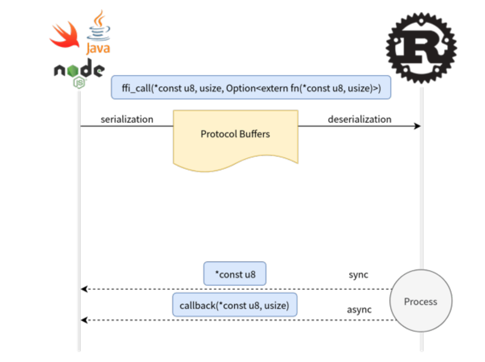
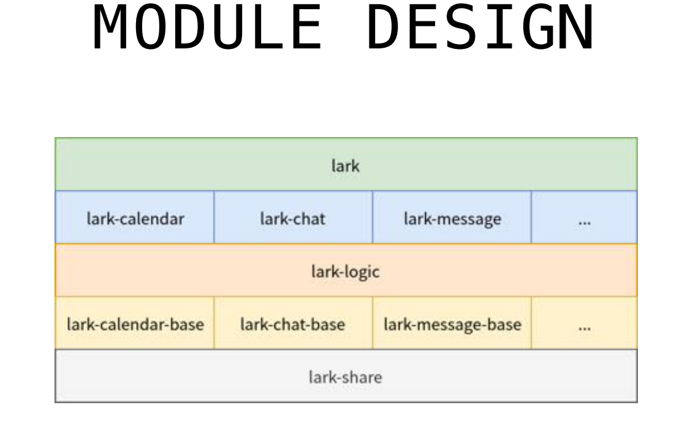
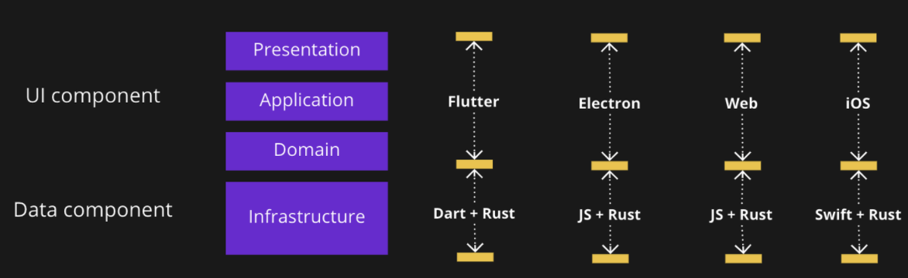
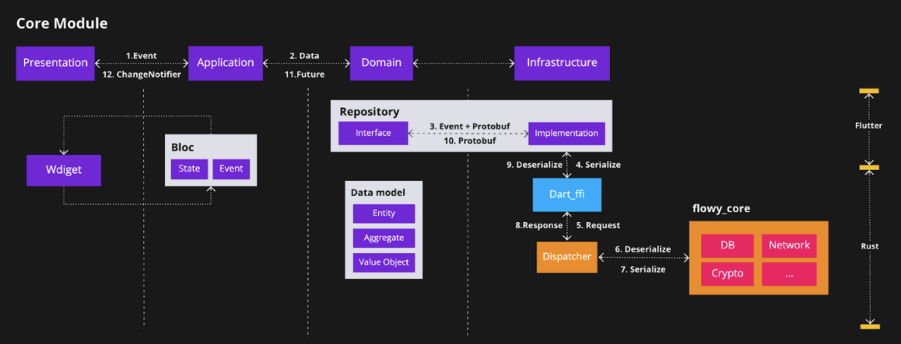
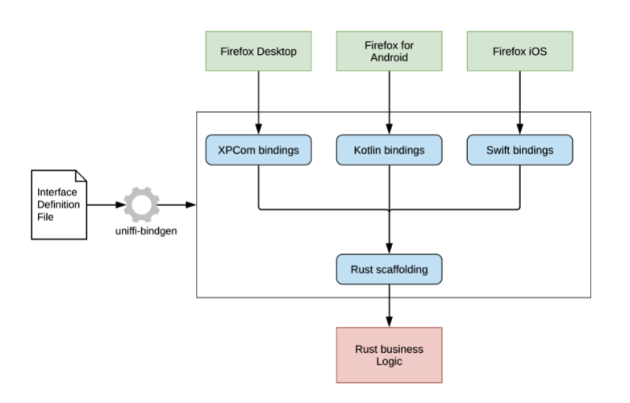

# Rust 移动开发与跨平台模式探究

作者：张汉东

## 引子

Rust 在服务端和嵌入式领域已经有很多跨平台模式的应用案例了，今天主要是来探究一下 Rust 在移动开发领域的跨平台开发模式。

本文中涉及所有信息均来自于互联网，如有错漏，请及时反馈。

## Rust 语言 对 iOS 和 Android 平台支持状态

目前 Rust 对 iOS 和 Android 平台 Target 都是 Tier 2  和 Tier 3 级别的支持，并且都支持 std 。

- Tier 2 表示在 Rust 项目的 CI 中会检查这些 Target 可以顺利构建，但不保证测试能通过。一般情况下，Tier 2 级的 Target 会正常工作。
- Tier 3 则不会在 Rust 项目的 CI 中出现。所以，在相应的平台下，不一定会构建成功。

**对 iOS 的支持：**

Tier 2:

- `aarch64-apple-ios`，即 ARM64 iOS
- `aarch64-apple-ios-sim`，即 Apple iOS Simulator on ARM64
- `x86_64-apple-ios`，即 64-bit x86 iOS

Tier 3:

- `aarch64-apple-ios-macabi`，即Apple Catalyst on ARM64
- `armv7-apple-ios`，即ARMv7 iOS, Cortex-a8
- `armv7s-apple-ios`
- `i386-apple-ios`，即32-bit x86 iOS
- `x86_64-apple-ios-macabi`，即Apple Catalyst on x86_64

**对 Android 的支持：**

Tier 2:

- `aarch64-linux-android` ，即 ARM64 Android
- `arm-linux-androideabi`，即 ARMv7 Android
- `armv7-linux-androideabi`，即 ARMv7a Android
- `i686-linux-android`，即 32-bit x86 Android
- `thumbv7neon-linux-androideabi`， 即 Thumb2-mode ARMv7a Android with NEON
- `x86_64-linux-android`，即 64-bit x86 Android


看得出来，Rust 对 iOS 和 Android 的支持还算可以。

## Rust 用于移动开发的几种方式

### 跨平台组件

一些公司使用 Rust 来开发跨平台组件，即，在 iOS 和 Andriod 之间共享代码。


对于 iOS ，Rust 可以直接通过FFi 的方式绑定 C-ABI 来进行交互，可以参考 Mozilla 近期发布的这篇[文章](https://blog.mozilla.org/data/2022/01/31/this-week-in-glean-building-and-deploying-a-rust-library-on-ios/)来了解如何在 iOS 应用中部署 Rust 库。对于 Android ，Rust 通过 JNI 相关的库来进行相关绑定，Rust 社区生态也有一些类似于 [android-ndk-rs](https://github.com/rust-windowing/android-ndk-rs)的工具来进行 NDK 开发。

**可以把这种模式称为：应用的 Rust 后端（App Backend-Rust）**。当然，Rust 也可以编译到 WebAssembly ，也可以共享到浏览器端（应用条件比客户端相对严格一些）或桌面端（比如 Electron）。

#### 公司：Dropbox

**为什么不用 Cpp 来共享代码？**

也许可以从 Dropbox 在 2019 年发布的文章[《在 iOS 和 Android 之间共享代码的隐藏成本》](https://dropbox.tech/mobile/the-not-so-hidden-cost-of-sharing-code-between-ios-and-android)中看到问题所在：Cpp共享代码会带来四类隐藏成本。以下摘要：

- 自定义框架和库的开销。为了和平台交互，需要自定义框架和库，这是一种成本。如果使用本地语言（java/kotlin/swift）则无需做这些工作。使用cpp的话，对开源社区贡献价值也很小，因为 cpp 几乎不存在移动开源社区。
- 自定义开发环境的开销。移动生态本身非常成熟，移动 IDE 非常丰富，谷歌和苹果都投入了大量资源，使它们成为相应平台上开发人员的最佳开发体验。但是使用 cpp 共享代码则意味着放弃这些好处。cpp 共享代码中本身也充斥着各种 Bug ，调试这些 Bug 很困难，尤其是多线程下的问题。
- 解决平台间差异的开销。不同操作系统之间是有实际的差异存在，必须花费大量时间将代码集成到不同平台并编写特定于平台的代码。（cpp 在跨平台抽象方面不如 Rust 更加容易？）
- 培训、招聘和留住开发人员的开销。有经验的 cpp 工程师越来越难以聘请（一年时间招不到人），尤其是对移动开发感兴趣的。所以，缺乏维护 C++ 代码库的关键专业知识的人才，从而导致花大量时间成本招聘和内部培训，但其实内部工程师大多对 cpp 的学习没什么兴趣，内部培训也成了问题。另外，移动开发人员根本不想从事 C++ 项目，这也导致了移动开发人员的离职。

如果写一次代码到处复用的成本开销超过了其收益，就没有必要使用这种策略了。所以， Dropbox 又回归了使用本地语言进行移动开发，直到现在 2022年。今年3月份 Dropbox 的一篇博客也说明了这一情况：[使 Android 的相机上传更快更可靠](https://dropbox.tech/mobile/making-camera-uploads-for-android-faster-and-more-reliable) 。

**Dropbox Capture 桌面客户端使用 Rust 开发跨平台组件**

虽然在移动领域，Dropbox 放弃了使用 Cpp 共享代码这种策略，但也没有使用 Rust。然而在 2021 年，Dropbox 的另一个团队，[Dropbox Capture](https://www.dropbox.com/capture) 则使用 Rust 来构建其桌面客户端的跨平台同步引擎组件。Capture 是一个视觉交流工具，旨在使团队可以轻松地使用屏幕录像、视频消息、屏幕截图或 GIF 异步共享他们的工作。

为什么使用 Rust 呢？

一方面，Rust 在 Dropbox 的产品中应用面越来越广，团队经验提升；另一方面，Rust 本身非常符合 Capture 这个场景，希望更好地控制截屏和录制能力、更好的错误处理以及更快的幕后性能。

使用 Rust 的收益：

- 没有自定义框架和库的开销。使用开源的 neon，可以轻松地从 TypeScript 调用本机操作系统代码，而无需任何开销（而且更可靠）。
- 更好的错误处理。极大提升了处理错误的能力。在 macOS 和 Windows 上使用一致的 API，使得团队能够添加更强大更统一的日志记录和监控。
- 更多的控制力。构建跨平台代码更加简单。将代码放到同一个地方可以轻松解决一些以往难以定位的问题。
- 更少的空间占用。使用 Rust 库让团队不再需要大约 17MB 的 Swift 库，而且还更省内存。
- 更容易扩展新特性。迁移到 Rust 也让团队能够做以前无法做的事情。比如，能够为 Windows 带来以前只存在于 macOS 上的功能。还能够引入新的裁剪工具、新的录制控件，并添加新的录制类型。Rust 能够让团队比以前更快、更省力地构建它们。

根据以上 Dropbox 的实践，可以对 Rust vs Cpp 在跨平台共享组件方面的优劣有一定了解。接下来再看看其他公司的实践。

#### 公司： FullStory

[FullStory 公司](https://www.fullstory.com/) 提供了数字体验智能 (DXI) 平台，提供了数据分析服务。该平台也提供了针对移动应用的数据采集功能，其中跨平台组件使用 Rust 开发。

**为什么选择 Rust ？**

当前的移动生态系统主要由 iOS 和 Android 设备组成。任何想要接触大多数移动用户的人都会发现自己必须开发两个版本的应用程序。

这两个平台存在显着差异：在语言级别上，iOS 应用程序主要是用 Swift（历史上是 ObjC）编写的；另一方面，Android 应用程序主要是用 Java 编写的，如今 Kotlin 越来越受欢迎。因为平台对现代移动应用程序想要做的所有事情都有不同的抽象，从创建按钮小部件到地理定位都不同，所以维护两个不同语言的版本会随着业务发展越来越困难。

FullSotry 公司面临的问题可能更加复杂，因为它们是提供框架给别人去使用，而不是直接发布应用程序。所以要考虑技术选择对客户的影响，例如与他们的代码进行有害交互的可能性，以及在 CPU 和内存使用方面对用户可见的性能影响。

**如何使用 Rust ？**

首先制定了一个粗略的设计准则： Rust 代码应包含与平台无关的通用代码，特定平台的代码应该保留在特定平台的代码中。

代码组织结构：

- `shared-core` crate，包含了大部分通用代码，并且使用 trait 来定义特定平台部分的接口。
- `shared-android` crate，用于提供与 Java 共享的代码接口。
- `shared-ios` crate， 用于提供与 ObjectiveC 共享的代码接口。
- `shared-mock` crate ，为了便于核心 Rust 代码的开发而实现了一个“模拟”平台，它提供所有相同的接口，但只是在桌面环境中运行。这有助于在纯 Rust 环境中开发许多东西，并避免了移动工具链的集成痛苦。

对于 iOS ，将 Rust 代码构建为静态库，使用 Ditto 编写脚本来构建 Rust 工具链，使用与 XCode 一致的 LLVM 版本。

对于 Android，将 Rust 构建为静态库，通过 CMake 与一些 C 代码链接，再给 Java 库共享。

**使用 Rust 以后的优势**

1. 能够编写高性能代码，而无需花费过多时间进行优化
2. 不必追踪客户在平台提供的 Rust 代码中报告的数据竞争导致的奇怪崩溃或错误
3. 可以有信任地引入对平台代码库不熟悉的开发人员，他们知道编译器会限制他们由于没有完全理解“烧入”他们大脑的代码而造成的损害。（Rust 语言比较受欢迎，新人也愿意学习）

**移动开发中使用 Rust 带来的痛苦是什么？**

FullStory 工程师在 hacknews 上面[透露](https://news.ycombinator.com/item?id=27493037)：

"The only real pain we felt was around iOS bitcode and that was mainly Apple's fault because they make the whole process so Byzantine if you aren't using clang."

"我们唯一真正感到痛苦的是围绕着iOS的位码，这主要是苹果的错，因为如果你不使用clang，他们会使整个过程变得非常复杂。"

关于此问题，在 Rust issues 中有记录：[https://github.com/rust-lang/rust/issues/35968 （未解决）](https://github.com/rust-lang/rust/issues/35968)，导致FullStory 团队无法直接使用上游 Rust 工具链，他们的解决办法是使用与 Xcode 相同版本的 LLVM来提供带有嵌入式 LLVM 位码的框架。

#### 公司：1Password

1Password 现在也加入了 Rust 基金会。其产品大约 63% 的 1Password 核心代码（加密和同步数据）使用了 Rust 。用 Rust 开发的跨平台组件来支持多个平台，包括移动端和浏览器（将 Rust 编译为 WebAssembly）。但 1Password 把这种方式叫「混合（hybrid）应用程序开发」。

> 1Password 也开源了一些跨平台库。比如， [sys-locale](https://github.com/1Password/sys-locale)，轻量级获取位置的跨平台库，支持 iOS/ Android/ MacOS/ Linux/ Windows/ WebAssembly 。还有一个早期开源的 `TypeShare`库，用于把一些用Rust写的类型生成为其他语言的对应类戏，目前已经不再维护，但是其公司内部还在使用。

下面这张图展示了1Password Linux 版本下 core 相关架构。


首先，1Password 这个 core 库是完全独立的 Rust 库，它定义了明确的 API 来供各个客户端来使用。

`op-app`和`op-ui`用于整合其他crates。大部分状态被完全保留在内部，以确保密钥和其他secrets得到正确的处理，同时也使每个客户端UI能够专注于他们的优势，而不是业务逻辑。 `foundation`  crate 为 core 提供特定平台的服务（OS Services）。等等。

目前这个通用的 core 库在 Linux 端比较成功，1Password 团队表示会在下一代 1Password 的产品中也采用这种架构。

> 1Password 趣事：
>
> 翻到一篇2019年论文，探讨了流行的[密码管理器的安全最佳实践](https://www.ise.io/casestudies/password-manager-hacking/)，包括 1Password 。并且同年，在 1P 社区论坛中针对该论文中提到 1P的安全问题引起[激烈讨论](https://1password.community/discussion/comment/493134#Comment_493134)，1P 成员也第一次提到 Rust 语言，也许这是 1P使用 Rust 的开端，现在1Password 是 Rust 基金会成员。


#### 公司：字节跳动-飞书

关于飞书使用 Rust 的公开资料很少，只有2019年字节跳动王枞在QCon分享的[《Rust 跨平台客户端开发在字节跳动的实践》](https://www.infoq.cn/article/oh79weak7z3s2xavo*bv)，从其中可以了解到，飞书使用 Rust 也是做跨平台组件。飞书客户端非 UI 部分由 Rust 跨平台实现，目前包括移动端和桌面端共 5 个平台。

**为什么跨平台使用Rust?**

1. 客户端开发有一定复杂度
   1. 性能需求
      1. 在有限的资源里满足日益增长的需求
      2. 需要更少的耗电量来满足日益增长的需求
   2. 实施复杂性
      1. 几乎是单体架构
      2. 底层代码的安全保障较少
2. 各个平台之间存在差异，团队不想做重复性的工作和 犯同样的错误。

**考虑跨平台能带来的收益：**

- 只需要一份代码库来进行设计、实施和审查
- 唯一面向服务端的客户端，便于实施安全策略

**如何做跨平台：**

- 不能影响用户体验。App应该做到性能足够好、耗电尽量少。
- 与原生平台交互应该非常方便
- 不应只是单独的一些组件，而是对整体代码做过权衡之后的核心代码（非 UI 代码可以跨平台，UI 代码使用本地语言）。

**语言选择：**

- 需要一个有安全性保证的系统级语言
- Cpp 不够，因为需要团队中每个人都是 Cpp 大师才能满足团队安全标准
- Rust 则有编译器，它就像一个大师一样，随时守护每个人编写的代码
- Rust 能保证内存安全和并发安全，意味着，可以让团队专注于业务，降低错误率
- Rust 对底层控制力强，但又不失现代语言的高级特性和抽象能力，可降低项目的维护成本

**飞书架构：**


如图，基本架构是通过一个线程池来管理不同的线程进行交互。



Rust 进程 和 Swift / Java / NodeJS 通过 FFi 和  Protocol Buffers （类似 RPC）的方式来进行调用。

Rust 库的模块组织结构如下：



每个crate都是独立构建、运行、测试和依赖。底层的一些 crate 不会频繁变动。

用到的 Rust 技术栈为：


**遇到的问题：**

1. 优化编译文件大小
2. Rust LLVM 和 苹果的 LLVM 版本不同，比特位不兼容 （和 FullStory 公司问题相同）


####  苹果商店免费精品游戏：Piccolo 

Piccolo 是一款适用于 iPhone、iPad 和（通过[Mac Catalyst](https://developer.apple.com/mac-catalyst/)）macOS 的 Othello（黑白棋） 应用程序，收获了 AppStore 2022年2月精选和2021年最爱游戏荣誉。

作者在其[博客文章](https://nadim.computer/posts/2022-02-11-maccatalyst.html)里探讨了 Rust 是比 Swfit 更适合编写游戏 AI 模块的语言。

博客文章主要观点摘要：

- Swift 并不是一种适合高度优化和高性能 AI 编程的语言。比如目前还不支持固定长度数组。
- 使用 Rust 编写 Othello AI 模块，并在 iPhone/iPad/macOS 平台之间共享。
- 在为 Swift 生成 Rust 绑定时（通过 C-ABI），作者声明在使用`cbindgen` 这个工具时需要注意，有时会在 Swift 代码的上下文中生成对 C 绑定不友好的函数签名，因为 Swfit 对某些类型支持不完善， 所以还需要在生成之后手工检查一下。
- 同样遇到了 Rust 工具链 LLVM 和  Apple 中使用 LLVM 版本不同而导致 BitCode 不兼容的问题。他使用了 [rust-bitcode](https://github.com/getditto/rust-bitcode) 来解决这个问题。


#### 开源产品： AppFlowy

[AppFlowy](https://www.appflowy.io/)是一款开源的笔记类应用，类似于 Notion 。但 AppFlowy 相比Notion更加灵活，用户不仅可以DIY自己的域名、页面外观，还可以跨多个平台使用。

>  虽然飞书使用 Rust 开发跨平台组件的细节不得而知，但是据飞书开发成员透露，其应用思路应该和 AppFlowy 是相似的。

AppFlowy 使用 Rust 和 Flutter 来开发，官方也通过一篇文章来介绍 [AppFlowy 的整体架构](https://blog-appflowy.ghost.io/tech-design-flutter-rust/)。

AppFlowy 的前端和后端服务都用到了 Rust。这里主要谈前端架构。

前端架构 AppFlowy 采用了领域驱动设计（DDD）的概念，采用分层架构

>  DDD，简单来说，就是业务架构映射到了系统架构之上，并能充分隔离业务和技术的边界。一般通过分层架构和六边形架构实现业务与技术实现的隔离。
>
> 分层架构：遵循“关注点分离”原则来进行上下分层，将属于业务逻辑的关注点放到领域层（Domain Layer）中，而将支撑业务逻辑的技术实现放到基础设施层（Infrastructure Layer）中。另外还有一个应用层（Application Layer），一方面通过暴露业务应用服务的 API 来作为业务的逻辑门面（Facade），另一方面它又是业务和技术实现的粘合剂。
>
> 六边形架构（端口-适配器）：遵循“内外分离”原则来分层。内部代表了应用的业务逻辑，外部代表应用的驱动逻辑、基础设施和其他诸如UI/DB 等层，这样更加清晰地勾勒出业务逻辑与技术实现的边界，且将业务逻辑放在了架构的核心位置。体现业务逻辑的应用层与领域层处于六边形架构的内核，并通过内部的六边形边界与基础设施的模块隔离开。在进行软件开发时，只要恪守架构上的六边形边界，就不会让技术实现的复杂度污染到业务逻辑，保证了领域的整洁。如果我们在领域层或应用层抽象了技术实现的接口，再通过依赖注入将控制的方向倒转，业务内核就会变得更加的稳定，不会因为技术选型或其他决策的变化而导致领域代码的修改。


AppFlowy 的前端架构分层了两大部分：

- UI 组件：负责 UI 部分，按 DDD 分层架构分为表示层、应用层和领域层。基于 Flutter 实现。
  - 表示层：由 Widget 和 Widget 的状态组成，负责向用户呈现信息并解释用户命令。
  - 应用层：不包含任何复杂的业务逻辑，是业务和技术实现的粘合剂。
  - 领域层：代表业务，管理业务状态或委托给基础设施层。不依赖于任何其他层。
- 数据组件：负责数据相关逻辑，按 DDD 分层架构是基础设施层。基于 Rust 来实现。
  - 支持更高层的通用技术能力。它处理 API、持久性、网络等。


抽象层级由基础设施层到表示层递增，复杂度则相反。

**如何跨平台**



拿 Flutter 来说，AppFlowy 通过实现 FlowySDK 来做到跨平台：在 Flutter 中定义接口，在 Rust 中实现接口，然后通过 Dart FFi 来绑定 Rust 实现，利用事件分发机制来。


这种模式的优点是：

- 可以轻松地添加或删除模块。也可以将模块变成动态库并按需加载，从而提高性能。
- 方便灵活。FlowySDK 很容易集成到不同的平台，因为它的 FFI 接口很简单。
- 更好的控制能力。用不同的 CPU/IO 资源无缝地对不同的事件进行分类。

缺点：

- 性能问题。 Flutter 和 Rust 之间通信使用 protobuf ，序列化和反序列化有一定开销。
- Event-Dispatch 模式对于开发人员来说心智负担过重。该团队没有使用 [flutter_rust_bridge](https://github.com/fzyzcjy/flutter_rust_bridge) ，是因为在他们开发的时候，Flutter 在 Web 和桌面上没有得到很好的支持。介于团队成员只有两人（创业团队），所以选择了Event-Dispatch 这种可以更加减少工作量的方式。

**AppFlowy DDD 架构整体业务处理流程**



流程如下：

1. 表示层的 Widget UI 小部件与用户互动，并将这些互动转移到特定的 Flutter Bloc 事件中。Bloc 将事件引起的变化发回给 Wdiget，最后，它根据新的状态更新用户界面。这里的 Bloc 代表 DDD 中应用层，它使用领域层提供的资源库或服务来处理 Bloc事件。
2. 将数据传递给下一层。
3. Repository 中定义了实现其业务需求的接口和数据模型。数据模型使用 Rust 中生成的protobuf来描述数据模型。使用protobuf能够更容易地将数据从Flutter端转换到Rust端，或者反之亦然，但序列化和反序列化是有代价的。一般没有问题，但有时在处理图片时会有内存问题，但可以优化。
4. 将请求序列化为二进制数据，并通过`Dart_ffi`将其送入`FlowySDK`。
5. 调度器（Dispatcher）找到请求的处理程序，然后用其数据调用它。每个模块声明它能处理哪些事件，并向调度器注册自己。
6. 处理程序将提取二进制数据，并根据事件将其反序列化为一个特定的数据结构，并做一些业务逻辑。
7. 将返回值序列化为二进制数据，并将其发送至调度器。
8. 响应包含一个状态代码，二进制数据作为返回值传递给调用者（caller）。
9. 将二进制数据反序列化为一个特定的 Dart 对象。
10. 传播`protobuf`对象到上层
11. Bloc 等待 `future`的完成，如果状态发生变化，则重建 Widget。

**相关**

`flutter_rust_bridge` 的作者 fzyzcjy 也在和 AppFlowy 的开发者沟通，后续 AppFlowy 有可能使用 `flutter_rust_bridge`，但目前这个进展比较缓慢。

#### 开源项目：Glean 

[Glean](https://github.com/mozilla/glean)是 Mozilla 开源的一款现代化跨平台遥测（Telemetry）库。它提供了 Glean SDK支持 `Rust/  Kotlin / Swift / Python / JavaScript / QML` 等多语言和开发环境。其中 `Rust/ Kotlin/ Swift/ Python`  SDK 是基于一个 Rust core 库来构建的，而 `Javascript/ QML` 是基于 JavaScript 核心库构建。

>  *Telemetry*（*遥测技术*），一般是指从物理网元或者虚拟网元上远程实时高速采集数据，实现对网络实时、高速和更精细的监控技术。

**跨平台支持：**

Glean 使用 [uniffi-rs](https://mozilla.github.io/uniffi-rs/) 来自动生成 Rust 库 FFi 绑定，通过需要编写一个接口定义语言（基于[WebIDL](https://heycam.github.io/webidl/)）文件来描述目标语言可用的方法和数据结构。然后可以生成 Kotlin / Swift 绑定。




### 跨平台开源框架 和 游戏引擎 

除了使用 Rust 开发跨平台共享组件之外，在 Rust 生态中，也有一些框架和游戏引擎来帮助你实现跨平台的应用和游戏。

#### GUI 框架 ： Tauri

[Tauri](https://github.com/tauri-apps/tauri) 主要是用于开发桌面平台，相比于 Electron 来说，更加轻量、性能更好。Tauri 可以使开发者利用每个平台的 Webview 技术栈，通过 JS Api 调用后台接口。目前支持 Windows/ MacOS/ Linux 等平台，对于 iOS / Android 移动平台的支持正在进行中。

> 1Password 8 使用 Electron 开发，引起很多用户的不满。因为 Electron 占用资源过多，也存在内存泄漏问题和安全隐患。用户们考虑到只是一个密码管理软件，不应该占用过多系统资源。也许未来 Tauri 会是一个好的替代。

**Tauri 架构**

Tauri 主要由两大组件构成：

- Tauri Core ，它是一个“伞形”的组织结构，由多个子crate组合而成。
  - `tauri-build`，实现了一些宏来帮助 Tauri 使用 Cargo 进行编译
  - `tauri-codegen`，用于处理内嵌的资源（assets）
  - `tauri-macros`，基于 `tauri-codegen`为 上下文、处理程序和命令提供了一些宏。
  - `tauri-runtime`， WebView 粘合层
  - `tauri-runtime-wry`，为tauri自己维护的跨平台渲染库 wry 提供直接的系统级交互，比如打印、监视器检测和其他与窗口相关的任务
  - `tauri-utils`，通用代码库。
  - `tauri`，门面层抽象，整合了上面几个库，提供最终 API 
- Tauri Tool，是一个外部工具库
  - `api`，是由 TypeScript 实现的，用于创建ESM(ES6Module)和CJS(CommonJS)，便于前端框架导入 js endpoint，这样 Webview 就可以调用并监听后端的活动了。
  - `bundler`，由 Rust 实现，实际是改造了`cargo-bundle` crate，用于为各个操作系统平台打包程序。
  - `cli-rs`，Rust 实现的跨平台 Cli 。
  - `cli-js`，是对 `cli-rs`的包装，使用 `napi-rs`为每个平台生成 npm 包。
  - `webdriver`，之前叫`tauri-driver`，是一个跨平台 WebDriver  Server。
- 其他
  - `tauri-app/create-tauri-app`，TypeScript实现的一个脚手架工具，帮助开发者快速创建 Tauri App。

**跨平台支持**

- `tauri-app/tao`，纯 Rust 实现的跨平台应用程序窗口创建库，支持 Windows、macOS、Linux、iOS 和 Android 等所有主要平台，基于 [`winit`](https://github.com/rust-windowing/winit)二次开发。
- `tauri-app/wry`，纯 Rust 实现的跨平台 WebView 渲染库，支持 Windows、macOS 和 Linux 等所有主要桌面平台。Tauri 使用 WRY 作为抽象层，负责确定使用哪个 webview（以及如何进行交互）。因为现在 iOS 和 macOS 都是用 `wkwebview`，所以相当于也支持了 iOS 。而对于 Andriod 的支持还在进行中。

`tauri-app/tao` 利用 Rust 的 trait 和 features 机制，完美实现了跨平台架构：

使用统一的 `Window` 、`Clipboard`、 `EventLoop` 等窗口抽象：

```rust
// Window 抽象
pub struct Window {
  pub(crate) window: platform_impl::Window,
}

// Clipboard 抽象
#[derive(Debug, Clone, Default)]
/// Object that allows you to access the `Clipboard` instance.
pub struct Clipboard(ClipboardPlatform);

// EventLoop 抽象
pub struct EventLoop<T: 'static> {
  pub(crate) event_loop: platform_impl::EventLoop<T>,
  pub(crate) _marker: ::std::marker::PhantomData<*mut ()>, // Not Send nor Sync
}
```

其内部由 `platform_impl`门面模块来负责调用各个平台的特定实现：

```rust
#[cfg(target_os = "windows")]
#[path = "windows/mod.rs"]
mod platform;
#[cfg(any(
  target_os = "linux",
  target_os = "dragonfly",
  target_os = "freebsd",
  target_os = "netbsd",
  target_os = "openbsd"
))]
#[path = "linux/mod.rs"]
mod platform;
#[cfg(target_os = "macos")]
#[path = "macos/mod.rs"]
mod platform;
#[cfg(target_os = "android")]
#[path = "android/mod.rs"]
mod platform;
#[cfg(target_os = "ios")]
#[path = "ios/mod.rs"]
mod platform;
```

对于 `tauri-app/wry`来说，跨平台架构的实现也是和 `tao` 类似的。

建立统一的跨平台抽象：

```rust
// WebView 抽象
pub struct WebView {
  window: Rc<Window>,
  webview: InnerWebView, 
}

pub struct WebViewBuilder<'a> {
    pub webview: WebViewAttributes,
    web_context: Option<&'a mut WebContext>,
    window: Window,
}

impl<'a> WebViewBuilder<'a> {
    pub fn build(self) -> Result<WebView> {
        let window = Rc::new(self.window);
        let webview = InnerWebView::new(window.clone(), self.webview, self.web_context)?;
        Ok(WebView { window, webview })
    }
}
```

​		而内部的 `InnerWebView` 则是平台特定行为代码，通过 cfg 和 features 来构造一个统一的门面模块，完成跨平台分发。

```rust
#[cfg(target_os = "android")]
pub(crate) mod android;
#[cfg(target_os = "android")]
use android::*;
#[cfg(any(
  target_os = "linux",
  target_os = "dragonfly",
  target_os = "freebsd",
  target_os = "netbsd",
  target_os = "openbsd"
))]
pub(crate) mod webkitgtk;
#[cfg(any(
  target_os = "linux",
  target_os = "dragonfly",
  target_os = "freebsd",
  target_os = "netbsd",
  target_os = "openbsd"
))]
use webkitgtk::*;
#[cfg(any(target_os = "macos", target_os = "ios"))]
pub(crate) mod wkwebview;
#[cfg(any(target_os = "macos", target_os = "ios"))]
use wkwebview::*;
#[cfg(target_os = "windows")]
pub(crate) mod webview2;
#[cfg(target_os = "windows")]
use self::webview2::*;
```

看得出来，使用 Rust 进行跨平台开发，是非常简洁的。

#### 游戏引擎：Bevy

[Bevy](https://bevyengine.org/) 是一个数据驱动的游戏引擎，目前在社区的声望很高，也得到了很多公司的赞助。Bevy 也是跨平台的，在主流桌面操作系统（Linux、macOS、Windows）上开箱即用，无需特殊配置。Bevy 的目标还有 Web 浏览器（通过 WebAssembly，有一定限制）、移动设备（Android 和 iOS，可以构建但不一定能运行）和游戏主机（等待支持）。

**跨平台支持**

Bevy 本身的抽象程度比较高，跨平台支持主要是依赖于底层的一些库：

- [`winit`](https://github.com/rust-windowing/winit)，包装为 `bevy_winit` crate，来提供跨平台窗口。跟tauri-app 类似。
- [`wgpu`](https://github.com/gfx-rs/wgpu)，用于 `bevy_render` crate，来提供跨平台渲染。这样在 `bevy_ui` 中就不需要关心特定平台细节了。
- 其他，比如底层音频库、I/O、Log处理、资源管理等都做了跨平台相关处理。

这些底层库实现跨平台的模式和上面 Tauri 的架构是相似的。

### 一些移动开发工具介绍

[cargo-mobile](https://github.com/BrainiumLLC/cargo-mobile) 是一个与框架无关的工具，可以生成 Rust 移动项目的所有样板文件，并且包含大量用于在移动设备上构建和运行的便捷命令，可以提升 Rust 在移动领域的开发体验。目前仅支持 macOS 和 Linux 。

[ndk-rs](https://github.com/rust-windowing/android-ndk-rs)， Android NDK 的 Rust 绑定库。该库在 Rust 移动领域生态中应用比较广泛，上面提到到公司产品和项目基本都用到了它。

##   Android 官方支持 Rust 的方式

自 2019 年以来，Android 团队一直致力于将 Rust 编程语言引入 Android 开源项目 (AOSP)中。在 2021 年 4月，谷歌宣布 Android 开源项目（AOSP）现在支持 Rust 编程语言来开发 OS。

关键信息摘录：

- 在 Android 系统中，使用 [Soong](https://android.googlesource.com/platform/build/soong/+/refs/heads/master/README.md)来代替 Cargo 作为构建系统和包管理器。但是也注重，Android 生态尽量减少与 Rust 社区的分歧，当有对 Rust 社区有益的贡献时，会以独立 cargo  crate 的方式贡献给社区。之所以不用 Cargo 完全是出于为了在 Android 中扩大使用 Rust 而做的考虑，Cargo 不太适合当前 Android 整体构建环境。

- 不支持 `build.rs`构建脚本。因为 `build.rs`需要仔细审查，为了避免在添加或更新第三方时引起供应链攻击之类的事情发生。而且 `build.rs`的常用功能，Soong 已经支持了。但支持过程宏。

- 仍然支持第三方 crates。

- 默认支持动态链接。Rust 生态是默认静态链接，但是对于 Android 来说，这种方式存在一定问题。因此，默认情况下，Soong 选择为设备目标动态链接 crate。

- Soong 还提供了对 `bindgen` / `cxx`/ `protobuf`/ `grpc`等 crates 的支持，为了方便开发。Android 团队充分验证了 Rust 和 C++ 之间的互操作性已经在很大程度上足以在 Android 中方便地使用 Rust。

- 也将 `rust-analyzer` / `clippy`/ `rustfmt`集成到了 构建系统中。

  

## 给Apple 的一封公开信：请用 Rust 替换 Objective-C

IronCore Labs 公司 CEO（ Patrick Walsh ）去年（2021.10）在其官网发布了一篇 [给Apple 的一封公开信：请用 Rust 替换 Objective-C](https://blog.ironcorelabs.com/an-open-letter-to-apple-please-please-replace-objective-c-with-rust-10df606c3dce) 的文章，内容摘要：

- iOS 15.1 更新[修复了 22 个漏洞](https://support.apple.com/en-us/HT212867)。谢谢你。但在这 22 个漏洞中，至少有 16 个是由于内存错误造成的，包括整数溢出、内存损坏、越界读写、释放后使用、缓冲区溢出等。
- 建议 Apple 通过 Rust 与 Swfit 的互操作性，让 Rust 语言成为苹果技术栈中一等公民。
- 然后使用 Rust 重写CoreAudio、CoreGraphics 和 WebKit 等关键部分，这些都是现实世界中针对 Apple 客户的攻击的主要载体。

这是一项艰巨的工作，但它会带来巨大的投资回报。迁移到 Rust 可以消除 70% 的漏洞，并且可能更接近 95% 的可远程利用的漏洞。专注于解析来自不受信任来源的数据的库将使Apple平台更加安全。

## 参考


- [https://foundation.rust-lang.org/posts/2022-03-08-member-spotlight-1password/](https://foundation.rust-lang.org/posts/2022-03-08-member-spotlight-1password/)
- [https://www.fullstory.com/blog/rust-at-fullstory-part-2-mobile-sdk/](https://www.fullstory.com/blog/rust-at-fullstory-part-2-mobile-sdk/)
- [https://digvijayu.medium.com/building-cross-platform-library-with-rust-for-ios-and-android-c56a448e4804](https://digvijayu.medium.com/building-cross-platform-library-with-rust-for-ios-and-android-c56a448e4804)
- [https://foundation.rust-lang.org/news/2022-03-08-member-spotlight-1password/](https://foundation.rust-lang.org/news/2022-03-08-member-spotlight-1password/)
- [https://dteare.medium.com/behind-the-scenes-of-1password-for-linux-d59b19143a23](https://foundation.rust-lang.org/news/2022-03-08-member-spotlight-1password/)
- [https://github.com/QConChina/QConBeijing2019/tree/master/%E7%A7%BB%E5%8A%A8%E6%96%B0%E7%94%9F%E6%80%81](https://github.com/QConChina/QConBeijing2019/tree/master/%E7%A7%BB%E5%8A%A8%E6%96%B0%E7%94%9F%E6%80%81)
- [https://rustrepo.com/repo/i-schuetz-rust_android_ios-rust-mobile](https://rustrepo.com/repo/i-schuetz-rust_android_ios-rust-mobile)
- [https://github.com/Dushistov/flapigen-rs](https://github.com/Dushistov/flapigen-rs)
- [https://github.com/ivanschuetz/wasm-rust-d3](https://github.com/ivanschuetz/wasm-rust-d3)
- [https://github.com/Co-Epi/app-backend-rust](https://github.com/Co-Epi/app-backend-rust)
- [https://macroquad.rs/tutorials/android/](https://macroquad.rs/tutorials/android/)
- [http://dockone.io/article/2434630](http://dockone.io/article/2434630)
- [https://dev.to/tauri/announcing-tauri-beta-more-efficient-crossplatform-apps-with-better-features-1nbd](https://dev.to/tauri/announcing-tauri-beta-more-efficient-crossplatform-apps-with-better-features-1nbd)
- [https://tauri.studio/docs/development/security](https://tauri.studio/docs/development/security)
- [https://rustmagazine.github.io/rust_magazine_2021/chapter_5/running_rust_on_android.html](https://rustmagazine.github.io/rust_magazine_2021/chapter_5/running_rust_on_android.html)
- [https://source.android.com/setup/build/rust/building-rust-modules/overview](https://source.android.com/setup/build/rust/building-rust-modules/overview)
- [https://blog.mozilla.org/data/2022/01/31/this-week-in-glean-building-and-deploying-a-rust-library-on-ios/](https://blog.mozilla.org/data/2022/01/31/this-week-in-glean-building-and-deploying-a-rust-library-on-ios/)
- [https://blog.ironcorelabs.com/an-open-letter-to-apple-please-please-replace-objective-c-with-rust-10df606c3dce](https://blog.ironcorelabs.com/an-open-letter-to-apple-please-please-replace-objective-c-with-rust-10df606c3dce)
- [https://nadim.computer/posts/2022-02-11-maccatalyst.html](https://nadim.computer/posts/2022-02-11-maccatalyst.html)
- [https://security.googleblog.com/2021/06/rustc-interop-in-android-platform.html](https://security.googleblog.com/2021/06/rustc-interop-in-android-platform.html)
- [https://source.android.com/setup/build/rust/building-rust-modules/android-rust-modules](https://source.android.com/setup/build/rust/building-rust-modules/android-rust-modules)