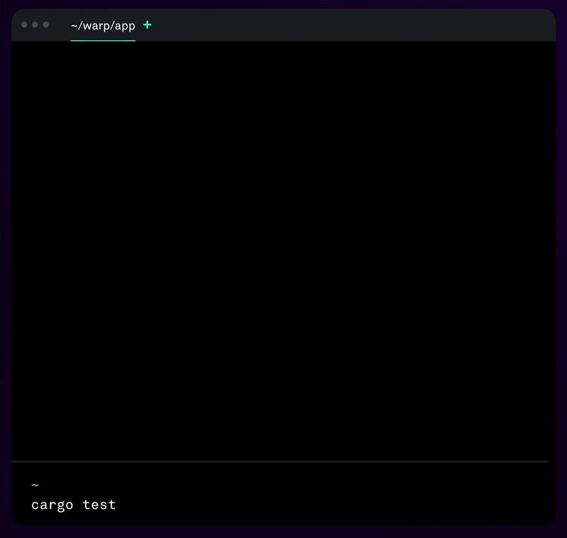

# TO-D 观察｜小小的终端何以撬动千万美元资本 

作者： 张汉东

> 本文首发投稿到 [**《TO-D 杂志》** ](https://2d2d.io/)。
>
> To-D 即 To Developers，主要指面向开发者市场的创业活动。但 To-D 并非一个独立的领域划分，它通常和 To-C, To-B 可能存在重叠。不管最终产生付费行为的是开发者个人，还是企业，只要其主要目标使用人群为 Developers 都算 To-D 产品。大家熟知的 Jetbrains, Postman, GitLab 等都属于 To-D 产品。

## 前言

最近在 Rust 社区连续看到三条新闻，都是和基础设施创业融资相关。

先是 DeisLabs 的九名核心成员集体离职，重新创办了 Fermyon 公司。DeisLabs 之前被微软收购，该团队有好几个 Rust 项目都进入了 CNCF，这些项目都是为了推动 WebAssembly 在云原生领域的应用。他们的新公司也是专注于 Rust 和 WebAssembly ，并且推出新的开源基础设施 Spin 。该公司首轮融资 400 w 美元。

然后是 Rust 社区知名开发者 Joe Gjengset 宣布成为 [ReadySet 公司](https://readyset.io/)的联合创始人，准备将其博士论文中的 Noria 数据库研究成果进行落地为 ReadySet ，为数据库提供 SQL 缓存引擎，可帮助开发人员构建高性能的实时应用程序，而无需更改代码或切换数据库。[该公司目前 A 轮融资 2900 w 美元](https://techcrunch.com/2022/04/05/readyset-raises-29m-to-expedite-access-to-enterprise-scale-app-data/)。

这两个项目的价值，作为一名软件工程师的我，还能够理解。但接下来这个项目，有点出乎我的意料。

昨天在推特上看到有人推荐一个 Rust 实现的新终端 Warp ，就去看了一下相关信息，发现这个终端竟然就在三天前（4.5）[融资 2300 w 美元](https://techcrunch.com/2022/04/05/warp-raises-23m-to-build-a-better-terminal/)。作为一名开发者，天天使用终端，而且都是免费的，万万没有想到终端竟然这么值钱。还有很多开发者朋友，和我一样同样感到惊奇。我在想，这里面一定有一些我还了解的东西，这不由得激发出我的好奇心来，于是就有了这篇文章。先卖个关子：你以为 Warp 只是个终端，但 Warp 的创始人和投资者并没有把它当作终端，这就是 2300 w美元背后的秘密。

**重要说明：这篇文章不是为了宣传 Warp，而是我本人想探索 Warp 融资 2300 w 美元背后的价值。** 所以，选择终端还是要看你个人的喜好，也无需和我探讨 Warp 到底好不好用。

## 终端的历史与困境

广义的终端（英语：Computer terminal），是指一台电脑或者计算机系统，用来让用户输入数据，及显示其计算结果的机器，简而言之就是人类用户与计算机交互的设备。终端有些是全电子的，也有些是机电的。其又名终端机，它与一部独立的电脑不同，但也是电脑组成的部分。

> 终端相关名词：
>
> - CLI: 命令行, 图形界面普及之前使用最为广泛的`用户界面`。
> - Terminal: 一种用来让用户`输入数据`到计算, 并`回显`计算结果的机器, 一个IO交互设备
> - Console: 一种特殊的终端。
> - Terminal Emulator: 终端模拟器, 利用程序模拟终端行为, 例如iterm2
> - TTY: 终端的统称，该名称沿用了历史习惯，电传打字机（**teletypewriter**）曾经是计算机的终端，它的缩写便是 **TTY**(**T**ele**TY**pewriter)。
> - Shell: 命令行解释器, 执行用户输入的命令并返回结果

最早期的大型机和小型机时代，计算机因为体积过于庞大，只能被安置于特殊的房间内。用户只能通过特殊的设备与这些计算机交互，这些设备就成为早期的终端。

随着个人微型电脑普及，终端设备也一直在发展，其概念也越来越模糊，根据历史我们可以总结：

- 字符终端: 文本终端, 仅仅接收和显示`文本信息`的终端。
- 基于字符的图形终端: 不仅仅可以显示文本信息, 还可以显示图形和图像, 进行复杂的操作。
- 运行窗口系统的图形终端: 现在我们使用的窗口系统。

> 小知识：字符终端设备VT100, 是第一批支持ANSI转移序列和光标控制的智能终端。

上面说的都是硬件终端设备，随着个人电脑普及，逐渐被键盘和显示器所代替。为了方便用户使用命令行操作电脑，人们又开发了一种终端模拟器程序，用于模拟`传统终端`行为。

一个终端模拟器的工作流程如下：

- 监听键盘事件，捕捉键盘输入
- 将键盘输入发送给 tty 驱动
- 获取tty驱动响应，输出结果(STDOUT/STDERR)
- 调用图形接口, 比如X11, 将输出回显到显示器上

现在主流操作系统都会带有终端模拟器，这足以说明它的重要性。尤其是对于广大开发者来说，终端模拟器是无法离开的存在。远的不说，在过去的二十年里，各种各样的终端模拟器层出不穷，围绕终端模拟器的各种工具也层出不穷。每个开发者为了拥有一个漂亮、方便、功能丰富的终端模拟器，也是煞费苦心。

虽然现在的常用的终端模拟器也有很多好用的，比如 Rust 实现的高性能跨平台现代化终端模拟器 [alacritty](https://github.com/alacritty/alacritty) 。但它们的内核其实还是一个传统的终端模拟器。现代开发者，要使用终端做很多事，从构建代码、执行和部署，与版本控制系统交互到与云端交互等。作为开发者日常离不开的工具，在当下日益增长的开发需求的时代，现在的终端模拟器却没有帮助开发者提升更多工作效率。

## Warp 商业价值探讨

### 解决了什么问题

而 Warp 的出现，让我看到了终端模拟器进化的下一代形态。

让我们先来看一张 Warp 的使用动图。

首先 Warp 的颜值就非常高，看得出来，它十分注重视觉设计，将界面按 块（block） 来划分，这样很容易阅读信息，而不像一般的终端模拟器，字符密密麻麻。

它还自带了命令提示，看上去也相当智能，并且还提供 workflow 功能。而这一切都是开箱即用，而你也可以配置。

另外值得关注的功能特性是对团队协作的支持，可以共享团队的终端模拟器会话，可以方便地解决团队之间沟通的问题。其他功能还有很多，包括集成了云端，可以让团队方便地共享剪切板等。更多功能可以去[这里](https://docs.warp.dev/)查看。

我还没有来得及自己的去挖掘 Warp 的具体功能，但是单从这些功能特性上来看，正如 Figma CEO Dylan 所说，Warp 这个产品和 Figma 很像，都是 **All in One，并且连接了云端，为团队协作提供了很多方便的功能**。事实上，正是 Figma CEO 领投了 Warp ，跟投的还有 Elad Gil （AirBnB、Pinterest、Stripe 和 Square 的早期投资者）、Jeff Weiner（领英执行董事长兼前CEO）和 Marc Benioff（Salesforce 创始人兼 CEO）。Dylan 认为 Warp 和 Figma 正是可以提升用户十倍工作效率的那种工具，他也承认投资 Warp 有赌博的成分。

了解 Warp 是个怎样的产品，且从 Figma CEO 那里得知他们背后投资的动机之后，我不禁在想另外一个问题。

### 商业模式

众所周知，Figma 虽然是面向设计师群体，也没有上市，但现在是百亿级估值的一个产品，那么Figma 的成功 Warp 能否复制？Warp 的商业模式难道也和 Figma 一样吗？

Warp 的官网问答页面简单地回答了这个问题：未来 Warp 会对个人免费，但是对公司和团队收费。看得出来，商业模式和 Figma 是类似的。

Figma 是属于产品驱动增长（PLG, Product-led Growth）型公司。所谓产品驱动增长，就是将产品本身作为获取、留存和扩张管道的产品策略。有很多公司 SaaS 类公司，比如Slack 和 Shopfiy 都通过这一策略得到了成功。Figma 通过 PLG 的方式，在早期注重社区，让用户主动体验大部分功能，并且在早期针对免费用户和商业用户进行了区分，通过用户不断的使用来积累数据，逐渐制定出科学合理的收费模式。

而 Warp 也是类似，产品初期就明确了免费和收费群体。开放公测，让用户主动体验大部分功能。可想而知，也会通过积累一些数据，去完善自己产品功能的同时，沉淀出精准的付费定价策略。

### 商业价值

但仅仅是商业模式一样就够吗？

Figma 之所以能这么成功，是因为它的产品已经超越了工具的属性。它除了帮助设计个人提升了开发效率，还帮助团队协作进入了一个新的层次，比如围绕设计师和非设计师都可以方便地跟踪和协作，而不会干扰设计师的工作，它拉进了设计师和非设计师的距离，对团队的交流规范产生了重要影响。

Warp 的产品形态，也是在朝着脱离终端模拟器这个简单的工具属性方向发展。它同样是在帮助个人开发者提升开发效率的基础上，增强团队协作功能。目前因为 Warp 刚公开测试，很多功能还在完善中，但可以预料，如果按这个模式走下去，开发者团队的交流规范也迟早因为 Warp 的普及而得到重要影响。可以预言，熟悉 Warp 工作模式的人，将再也回不去传统终端模拟器上。

全球设计师大约有 2000 多万，Figma 2016 年上线，仅用了四年时间就达到了全球第一，估值达百亿美元。而据 GitHub 2021 Octoverse统计，全球开发者达到 7300 万之多，未来只会更多。

此时，我想，这也许就是 Warp 的商业价值所在。

## Warp 的工作机制

经过上面的了解，我们知道 Warp 的定位不仅仅是一个终端模拟器，而是一个基础设施。

作为一个基础设施，Warp 不仅仅注重视觉和交互设计，更加注重质量。基础设施的质量指标包括：安全、健壮和高性能。性能是 Warp 团队最看重的指标，但也不想因为性能而牺牲掉安全和健壮性，所以，Warp 选择使用 Rust 语言来实现。使用 Rust 技术栈（包括 WebAssembly）也方便构建跨平台支持。

在底层，使用 Metal （Mac 的 GPU API）直接用 GPU 进行 UI 渲染。之所以使用 GPU 进行渲染，是因为团队想摆脱 CPU 上面的许多软件和架构瓶颈，来适应更高分辨率的显示器。选择 Metal 而不是 OpenGL 作为 GPU API，因为 Warp 把 MacOS 作为第一个平台。Xcode 中的 Metal 调试工具非常出色，使 Warp 团队能够检查纹理资源并轻松测量帧速率和 GPU 内存大小等重要指标。Mac 平台现在也是大多数开发者选择的重要生产力工具。

但是，目前 Rust 对 GPU 支持并不是很完善，没有开箱即用的合适的 UI 库。团队考虑过 [Azul](https://azul.rs/)和[Druid](https://github.com/linebender/druid)，但这两者都处于实验阶段，所以团队决定和 Atom 编辑器联合创始人 [Nathan Sobo](https://github.com/nathansobo) 合作，使用他创建的一个受 Flutter 启发的 Rust UI 框架，不久后应该会开源。在未来，会支持更多的渲染后端，比如OpenGL 和 WebGL（会通过 wasm 支持）。同时也和 Nathan 合作，在 Warp 中构建了一个文本编辑器。

Warp 也 fork 了 [Alacritty](https://github.com/alacritty/alacritty) 的模型代码，用于处理数据模型，为 Warp 界面中的块实现提供了帮助。

看得出来，Warp 作为一个商业产品，它并没有将其产品的全部代码进行开源。但他们在实现产品过程中，通过解决 Rust  GUI 和 GPU 渲染相关的问题，沉淀出一些工具和库，会以开源的方式贡献给社区。

虽说要走 PLG 路线，开源社区非常重要，但也并不是说盲目地之间把产品全部开源出来。还是要根据自己的商业模式和产品形态做出最好的权衡。

## 感悟

综上，Warp 是一个很有潜力的终端模拟器产品，或者说，是一个很有潜力的开发者终端生产力平台。未来可期。

不过，作为一名中国的开发者，这几年目睹华为被断供芯片，尤其是在前不久的 Figma 断供大疆事件，我不禁对  Warp 有所担忧，它会不会也和 Figma 一样，也有断供风险。因为 Warp 也是有账号系统的，随时封禁你公司的账户是很方便的。

Warp 给我的感触最深的不是它的功能有多丰富强大，也不是它巨大的商业价值，而是，它很可能标志着国外软件现代化革命浪潮的开始。我们中国能敢上这一波吗？

山形海岸已变迁，云垒故道俱为烟。吾辈登临应有意，敢为李杜续新篇。

## 参考

- [Dylan Field：Why I'm Leading Warp's Series A](https://www.linkedin.com/pulse/why-im-leading-warps-series-dylan-field)
- [How Warp Works](https://www.warp.dev/blog/how-warp-works)
- [https://news.ycombinator.com/item?id=30921231](https://news.ycombinator.com/item?id=30921231)
- [Warp on Producthunt ](https://www.producthunt.com/posts/warp?utm_source=badge-featured&utm_medium=badge&utm_souce=badge-warp)
- [https://www.warp.dev/](https://www.warp.dev/)
